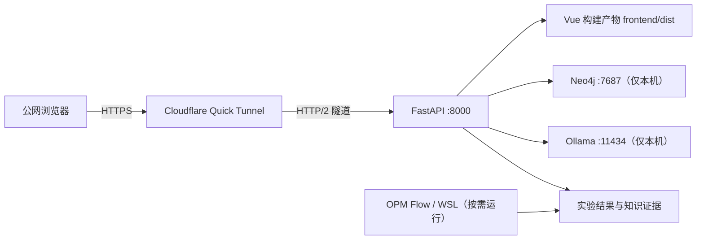
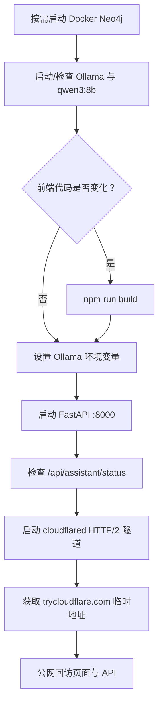

# PetroAgent 临时公网代理说明

## 1. 文档目的

本文记录 PetroAgent 使用 Cloudflare Quick Tunnel 从 Windows 本机临时发布到公网的完整流程，适用于功能演示、阶段汇报和少量可信协作者临时访问。

这套方案不需要购买服务器，也不需要把 Neo4j、Ollama 或 OPM Flow 的端口直接开放到公网。但它不包含账号登录、固定域名和可用性保障，因此不能直接作为正式生产部署方案。

## 2. 当前代理架构



公网只代理 `http://127.0.0.1:8000`。以下端口不应直接暴露：

- Neo4j HTTP：`7474`
- Neo4j Bolt：`7687`
- Ollama：`11434`
- Vite 开发服务器：`5173`

FastAPI 同时提供 API 和 `frontend/dist` 中的 Vue 页面，因此公网代理只需要一个入口，不需要单独代理前端。

## 3. 本次已完成的准备

Cloudflare 客户端使用官方单文件版本，保存在：

```text
.tools/cloudflared/cloudflared.exe
```

`.tools/` 已加入 `.gitignore`，不会将约 55 MB 的本地工具误提交到 GitHub。

隧道日志保存在：

```text
outputs/logs/cloudflared-tunnel.log
```

`outputs/logs/` 已被 Git 忽略。

前端 API 地址已改成同源相对路径：

- 生产模式：浏览器通过当前页面所在域名访问 `/api/...`；
- Vite 开发模式：由 Vite 将 `/api` 和 `/outputs` 代理到 `127.0.0.1:8000`；
- 前后端确实分域部署时，才使用 `VITE_API_BASE` 指定完整 API 地址。

这项修改避免公网浏览器错误地请求访问者自己电脑上的 `127.0.0.1:8000`，同时消除了此前的 CORS `OPTIONS 400` 问题。

## 4. 首次准备

### 4.1 进入项目并激活环境

```powershell
cd F:\Projects\petro-agent
.\.venv\Scripts\Activate.ps1
```

### 4.2 检查 Cloudflare 客户端

```powershell
.\.tools\cloudflared\cloudflared.exe --version
```

若本地文件不存在，可以从 Cloudflare 官方发布页重新下载 `cloudflared-windows-amd64.exe`，保存为：

```text
F:\Projects\petro-agent\.tools\cloudflared\cloudflared.exe
```

### 4.3 安装前端依赖

只有首次运行、依赖发生变化或 `node_modules` 被清理后需要执行：

```powershell
cd F:\Projects\petro-agent\frontend
npm install
cd ..
```

## 5. 日常启动顺序

### 5.1 按需启动 Neo4j

需要使用图谱查询、规则证据和解释链时执行：

```powershell
docker compose up -d neo4j
docker compose ps
```

只查看已有实验文件时可以跳过，但页面会显示 Neo4j 离线，相关图谱功能不可用。

### 5.2 启动并检查 Ollama

如果 Ollama 没有以系统后台服务运行，在独立终端执行：

```powershell
ollama serve
```

在另一个终端检查服务和模型：

```powershell
Invoke-RestMethod http://127.0.0.1:11434/api/tags
ollama list
```

当前配置使用 `qwen3:8b`。本地不存在时执行：

```powershell
ollama pull qwen3:8b
```

### 5.3 构建 Vue 页面

前端源码发生变化后执行；没有变化时可以跳过：

```powershell
cd F:\Projects\petro-agent\frontend
npm run build
cd ..
```

构建结果写入 `frontend/dist`，随后由 FastAPI 直接托管。公网演示不需要运行 `npm run dev`。

### 5.4 配置 Ollama 并启动 FastAPI

在项目根目录执行：

```powershell
$env:PETRO_AGENT_LLM_PROVIDER="ollama"
$env:PETRO_AGENT_LLM_MODEL="qwen3:8b"
$env:PETRO_AGENT_LLM_BASE_URL="http://127.0.0.1:11434"
$env:PETRO_AGENT_LLM_TEMPERATURE="0.4"
python -m uvicorn petro_agent.api.main:app --app-dir src --host 127.0.0.1 --port 8000
```

注意：模块名是 `petro_agent`，参数是 `--app-dir`，命令中不应添加 Markdown 转义字符 `\`。

该终端必须保持运行。浏览器本地检查地址：

```text
http://127.0.0.1:8000
http://127.0.0.1:8000/docs
```

在另一个终端检查模型状态：

```powershell
Invoke-RestMethod http://127.0.0.1:8000/api/assistant/status
```

预期返回中的 `provider` 为 `ollama`、`model` 为 `qwen3:8b`。如果显示 `mock`，说明启动 FastAPI 的同一个终端没有设置 Ollama 环境变量，需要停止后端并在正确设置变量后重新启动。

### 5.5 启动 Cloudflare Quick Tunnel

新开一个 PowerShell 终端：

```powershell
cd F:\Projects\petro-agent
.\.tools\cloudflared\cloudflared.exe tunnel --url http://127.0.0.1:8000 --protocol http2 --no-autoupdate --logfile outputs/logs/cloudflared-tunnel.log --loglevel info
```

当前本机网络环境下默认 QUIC 曾出现超时，因此固定使用 `--protocol http2`。

看到以下日志代表隧道连接成功：

```text
Registered tunnel connection
```

终端会生成类似地址：

```text
https://random-words.trycloudflare.com
```

Quick Tunnel 每次重新启动通常都会生成新的随机域名，不能将某次地址视为永久地址。

## 6. 启动流程总览



## 7. 运行验证与监控

### 7.1 检查本机端口

```powershell
netstat -ano | Select-String ":8000"
```

正常情况下应有一条 `LISTENING` 记录。

### 7.2 检查进程

```powershell
Get-Process python,cloudflared -ErrorAction SilentlyContinue |
  Select-Object Id,ProcessName,StartTime
```

### 7.3 持续查看隧道日志

```powershell
Get-Content outputs/logs/cloudflared-tunnel.log -Wait
```

### 7.4 验证本地接口

```powershell
Invoke-RestMethod http://127.0.0.1:8000/api/assistant/status
Invoke-RestMethod http://127.0.0.1:8000/api/experiments
```

### 7.5 验证公网接口

将 `$publicUrl` 替换成本次终端生成的地址：

```powershell
$publicUrl="https://random-words.trycloudflare.com"
Invoke-WebRequest $publicUrl -UseBasicParsing
Invoke-RestMethod "$publicUrl/api/assistant/status"
```

页面或静态资源更新后，浏览器可使用 `Ctrl+F5` 强制刷新。

## 8. 日常关闭顺序

1. 在 Cloudflare Tunnel 终端按 `Ctrl+C`，立即撤销公网入口；
2. 在 FastAPI 终端按 `Ctrl+C`；
3. 在手动运行的 `ollama serve` 终端按 `Ctrl+C`；
4. 按需停止 Neo4j。

停止 Docker Neo4j：

```powershell
docker compose stop neo4j
```

若终端已关闭但后台进程仍存在，可先查询 PID，再精确停止：

```powershell
Get-Process python,cloudflared -ErrorAction SilentlyContinue |
  Select-Object Id,ProcessName,Path,StartTime
Stop-Process -Id <需要停止的PID>
```

不要使用不加筛选的批量结束 Python 进程命令，以免关闭其他项目或编辑器正在使用的 Python。

## 9. 常见故障

### 9.1 `Errno 10048`：8000 端口已被占用

原因是已有 FastAPI 进程正在监听端口。先定位进程：

```powershell
netstat -ano | Select-String ":8000"
Get-Process -Id <PID>
```

如果已有接口可用，直接沿用，不要再次启动。如果需要更换环境变量，先精确停止该 PID，再重新启动 FastAPI。

### 9.2 `OPTIONS /api/... 400 Bad Request`

历史原因是 Vue 构建产物将 API 写死为 `http://127.0.0.1:8000`，公网页面因跨域预检失败而无法加载数据。当前代码已经改为同源请求。

若旧页面仍报错：

1. 在 `frontend` 目录重新执行 `npm run build`；
2. 确认 FastAPI 返回的新 `frontend/dist/index.html`；
3. 浏览器按 `Ctrl+F5` 或使用无痕窗口；
4. 检查是否错误设置了旧的 `VITE_API_BASE`。

### 9.3 QUIC 连接超时

日志可能出现：

```text
failed to dial to edge with quic
```

使用本文命令中的 `--protocol http2`。代理软件、防火墙或企业网络经常会限制 UDP/QUIC。

### 9.4 `WinError 10054`

表示客户端或代理提前关闭了 TCP 连接，常见于浏览器取消请求、页面刷新或此前的跨域失败。只要服务仍能返回 200，通常不代表 FastAPI 崩溃。

### 9.5 `/favicon.ico 404`

仅表示尚未配置浏览器标签页图标，不影响 API 和页面功能。

### 9.6 公网地址打不开

依次检查：

1. FastAPI 终端是否仍在运行；
2. `http://127.0.0.1:8000` 是否能本机访问；
3. cloudflared 终端是否仍在运行；
4. 日志是否出现 `Registered tunnel connection`；
5. 是否仍在使用本次运行生成的最新随机地址。

## 10. 安全边界

Cloudflare Quick Tunnel 地址没有项目级身份认证。系统会在访问者进入或刷新首页时透明记录一次 IP，
但任何得到链接的人仍可能访问当前公开的页面和 API，因此：

- 只向可信的临时演示对象发送链接；
- 不上传真实油藏、井位、生产动态或其他保密科研数据；
- 不把 `.env`、Neo4j 密码、API 密钥或模型凭据写入前端；
- 不开放 `7474`、`7687`、`11434`、`5173` 等内部端口；
- 演示结束后优先停止 cloudflared；
- 定期检查 API 日志中是否存在异常调用；
- 需要真实数据时，应先增加登录认证、授权、上传限制、接口限流和访问审计。

Quick Tunnel 没有固定地址和可用性保证。若需要长期公网访问，应升级为 Cloudflare 账号下的 Named Tunnel，并进一步配置：

- 自有域名与固定子域名；
- Cloudflare Access 身份认证；
- Nginx/Caddy 或等价的应用边界；
- 后台任务队列和并发控制；
- 数据备份、日志轮转和健康检查；
- 面向真实科研数据的权限、脱敏和审计策略。

## 11. 与 OPM Flow/WSL 的关系

浏览现有实验结果、规则、推荐、报告和图谱时，不需要持续启动 WSL 或 OPM Flow。

只有重新生成 Deck 算例、执行参数扫描或开展新的物理模拟时才需要进入 WSL，并在 WSL 中运行 OPM Flow。完成后的实验数据仍由 Windows 侧 FastAPI 读取并通过同一个公网入口展示。
