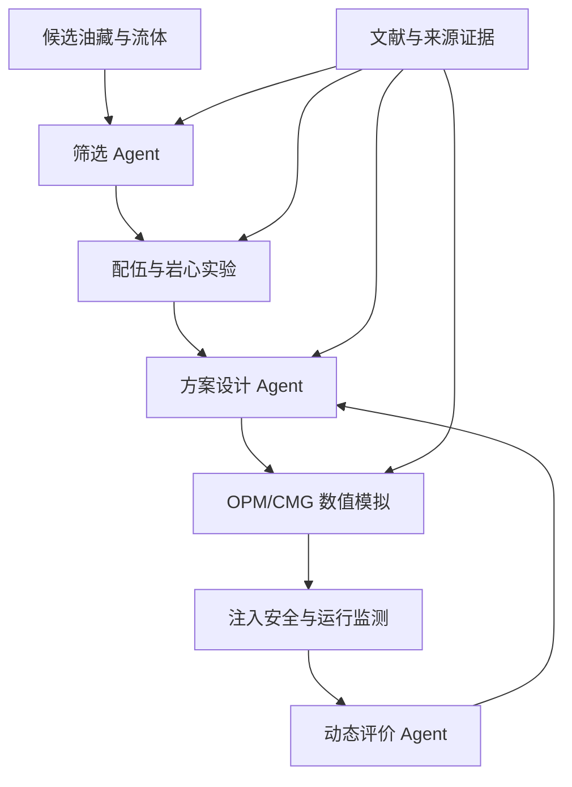

# PetroAgent M1

> 当前版本：`v0.9.1`（参数敏感性分析与 Web 展示）

## v0.9.1：polymer_sensitivity_v1 已完成

`polymer_sensitivity_v1` 已在 OPM Flow 2026.04 下完成 3×3 参数扫描，9 个算例
全部成功。当前新增：

- 校验 `cases.csv` 与 `time_series.csv` 的字段、主键、空值、数值范围和时间覆盖；
- 对比聚合物浓度与注入速率对累计产油、末期含水率和压力的影响；
- 生成终值曲线、动态曲线、参数响应矩阵和 Markdown 技术报告；
- FastAPI 提供实验列表、分析摘要和受控文件下载接口；
- Vue 工作台自动展示最新完成的敏感性实验。

重新生成分析产物：

```powershell
python scripts\analyze_parameter_sweep.py polymer_sensitivity_v1
```

分析结果位于：

```text
outputs/experiments/polymer_sensitivity_v1/analysis/
├─ summary.json
├─ quality_summary.json
├─ case_metrics.csv
├─ report.md
└─ figures/
   ├─ final_metrics.png
   ├─ time_series.png
   └─ parameter_response_heatmaps.png
```

Web API：

```text
GET /api/experiments
GET /api/experiments/polymer_sensitivity_v1
GET /api/experiments/polymer_sensitivity_v1/files/<analysis-file>
```

## v0.9.0：参数化 Deck 与多算例合成数据集

本版在 `v0.8.0` 的 ESMRY 自动分析闭环上增加批量实验编排：

- 使用显式占位符和参数白名单生成派生 Deck，不猜测修改 Deck 关键字；
- 支持 `cartesian`（参数笛卡尔积）与 `zip`（成对组合）；
- 设置 `max_cases`，防止误生成超大实验；
- 每个算例使用独立的 Deck、Flow 输出、日志、转换结果和清单；
- 单个算例失败不会中断剩余实验，失败原因进入清单和数据集；
- 默认复用已经成功的算例，支持断点续跑；
- 从每个 ESMRY 计算算例级标签，并汇总完整时间序列；
- 所有汇总产物明确标记为 `OPM数值模拟数据`。

### 1. 给基础 Deck 加入参数占位符

只在确定允许修改的位置加入占位符。例如：

```text
-- 聚合物浓度所在的数值位置
{{PETRO_PARAM_POLYMER_CONCENTRATION}}

-- 注入速率所在的数值位置
{{PETRO_PARAM_INJECTION_RATE}}
```

占位符可以位于根 `.DATA` 或其同目录的 `.INC` 等文本 INCLUDE 文件中。程序会
复制整个案例目录后修改派生副本，不会改动基础 Deck。占位符必须精确放在原数值
位置，不能额外保留旧数值。

### 2. 配置参数实验

模板位于：

```text
config/experiments/polymer_sensitivity.yaml
```

核心配置：

```yaml
experiment_id: polymer_sensitivity_v1
analysis_case_id: polymer_simple2d
data_nature: OPM数值模拟数据
base_deck: data/opm/polymer_simple2D/2D_THREEPHASE_POLY_HETER.DATA
output_root: outputs/experiments
design: cartesian
max_cases: 30

parameters:
  polymer_concentration:
    token: "{{PETRO_PARAM_POLYMER_CONCENTRATION}}"
    values: [0.5, 1.0, 1.5]
    unit: "kg/m3"
    format: ".6g"
  injection_rate:
    token: "{{PETRO_PARAM_INJECTION_RATE}}"
    values: [100, 150, 200]
    unit: "m3/day"
    format: ".6g"
```

上例生成 `3 × 3 = 9` 个算例。第一批建议保持在 10～30 个算例以内，先确认每个
参数在 Deck 中确实生效，再扩大规模。

### 3. 先只生成派生 Deck

```powershell
python scripts\run_parameter_sweep.py `
  "config\experiments\polymer_sensitivity.yaml" `
  --prepare-only
```

检查 `outputs\experiments\<experiment_id>\derived_decks` 中的数值和 INCLUDE
路径无误后，再进行真实批量模拟。

### 4. 批量运行并生成数据集

```powershell
python scripts\run_parameter_sweep.py `
  "config\experiments\polymer_sensitivity.yaml"
```

默认会跳过已经成功的算例。需要强制重新运行全部算例时：

```powershell
python scripts\run_parameter_sweep.py `
  "config\experiments\polymer_sensitivity.yaml" `
  --no-resume
```

主要输出：

```text
outputs/experiments/<experiment_id>/
├─ derived_decks/<case_id>/       # 派生 Deck 与参数清单
├─ cases/<case_id>/
│  ├─ flow/                       # ESMRY、Flow 日志和运行清单
│  ├─ converted/                  # 标准 CSV、向量目录和元数据
│  └─ case_manifest.json          # 状态、参数、标签与溯源
├─ dataset/
│  ├─ cases.csv                   # 每个算例一行的参数、状态和标签
│  └─ time_series.csv             # 所有成功算例的完整时间序列
└─ experiment_manifest.json       # 实验总清单
```

`cases.csv` 当前可计算的标签包括模拟天数、最终累计产油量、最终累计产水量、
最终累计注水量、最终含水率、峰值产油速率和平均产油速率。ESMRY 缺少某字段时，
对应标签留空，不由程序或大语言模型猜测。

`analysis_case_id` 是实验到领域案例的正式血缘键。FastAPI 会把实验
`polymer_sensitivity_v1` 归到案例 `polymer_simple2d`，但不会把演示 CSV 与
OPM 时间序列直接拼接；两者的数据性质和溯源仍保持独立。

### 5. Git 中保留什么

参数扫描的 `flow/`、`converted/` 和 `derived_decks/` 是可重算工作产物，体积大、
更新频繁，已在 `.gitignore` 中忽略。建议在 Git 中保留：

- 实验 YAML 配置和分析脚本；
- `experiment_manifest.json` 与每个 `case_manifest.json`；
- `dataset/cases.csv`、`dataset/time_series.csv` 等汇总数据；
- `analysis/` 下的质量摘要、指标表、图表和 Markdown 报告。

已经被 Git 跟踪的历史 Flow 文件不会因为新增忽略规则而自动移出索引。是否清理
历史索引应单独评估后执行，不能删除本地实验结果。

## 下一阶段：v0.9.2 水驱基准与增量评价

当前 9 个方案的最低聚合物浓度仍为 0.5 kg/m³，只能比较聚合物方案之间的差异，
不能严格回答“相对水驱增油多少”。下一阶段按以下顺序执行：

1. **冻结本轮成果**：确认配置、Flow 版本、Deck 哈希、9 个 case manifest、汇总
   CSV、分析报告和前端构建可以相互追溯。
2. **设计独立水驱基准**：从同一基础 Deck 派生无聚合物方案，保持网格、初始条件、
   井位、注入速率和 10,960 天终止时间一致；不直接假设浓度写成 0 就等同水驱。
3. **小规模预检**：先只生成 Deck，并对 100、150、200 m³/day 三个水驱算例各跑
   一个，检查关键字、收敛性、质量守恒和 Summary 字段。
4. **建立成对指标**：按注入速率匹配水驱与聚合物驱，计算增量累计油、增量产水、
   末期含水率差、压力差和单位聚合物增油量。
5. **加入经济与约束层**：增加聚合物用量/成本、注入能耗、产水处理和压力上限，
   将“最大产油”升级为可解释的约束优化问题。
6. **更新应用层**：FastAPI 返回基准—方案配对结果，Vue 增加增量指标和方案排序；
   验证稳定后再把实验、算例和汇总指标轻量写回 Neo4j。

进入下一轮 Flow 前的验收门槛：基准 Deck 与聚合物 Deck 仅在声明的化学驱设置上
存在差异；三个基准算例均成功；字段和单位完整；已有 9 个聚合物算例不被覆盖。

当前批量阶段不自动写入 Neo4j；敏感性摘要、图表和报告已经接入 Web 页面。
实例图谱写回仍按原计划属于后续版本。

## v0.7.0～v0.8.0：OPM Summary 自动分析闭环

`v0.7.0` 新增：

- 通过 WSL 中 OPM Python 绑定读取 `.ESMRY`；
- 枚举全部 Summary 向量、对象名称、作用域和原始单位；
- 映射已确认的全场向量，未知向量保留在目录中；
- 输出标准时间序列 CSV、向量目录 CSV 和转换元数据 JSON。

只转换并检查向量：

```powershell
python scripts\convert_opm_summary.py `
  "outputs\opm\polymer_simple2D\2D_THREEPHASE_POLY_HETER.ESMRY" `
  --output-dir "outputs\converted" `
  --case-id "polymer_simple2d"
```

主要输出：

```text
outputs/converted/polymer_simple2d_summary_standard.csv
outputs/converted/polymer_simple2d_summary_vectors.csv
outputs/converted/polymer_simple2d_summary_metadata.json
```

`v0.8.0` 新增完整入口，将标准 CSV 自动交给现有 `analyze_csv()`：

```powershell
python scripts\analyze_opm_summary.py `
  "outputs\opm\polymer_simple2D\2D_THREEPHASE_POLY_HETER.ESMRY" `
  --output-root "outputs" `
  --case-id "polymer_simple2d"
```

完整链路：

```text
ESMRY
→ 向量与单位目录
→ PetroAgent 标准 CSV
→ 数据与知识规则校验
→ 指标汇总
→ 科研图表
→ Markdown 统一报告
```

最终报告位于：

```text
outputs/reports/polymer_simple2d.md
```

本阶段的数据性质固定为 OPM Flow 数值模拟数据，不代表真实油田生产数据。
如果提示无法导入 `opm.io.ecl.ESmry`，先在 PowerShell 中确认 WSL Python
绑定是否存在：

```powershell
wsl.exe -d Ubuntu-24.04 -- python3 -c "from opm.io.ecl import ESmry; print('OK')"
```

当前优先读取 `ESMRY`；`SMSPEC + UNSMRY` 兼容读取属于后续增强项，不在
本次两个版本的完成范围内。

面向石油工程科研的第一阶段智能体内核。项目以 OPM 官方开放案例
`polymer_simple2D` 为主案例，以 `SPE9` 为跨场景验证案例，先建立一个
可测试、可追溯、可替换数据源的确定性分析底座，并在同一项目中建设
`PetroleumEngineeringCoreOntology v0.2`（石油工程核心本体 v0.2），并提供
YAML 到 Neo4j 的可重复导入与查询适配层。

> 当前版本：`PetroAgent v0.9.1（敏感性分析与 Web 展示） / Knowledge Foundation v0.2.0`
> Python：`3.10+`  
> 当前边界：确定性分析内核＋YAML知识源＋Neo4j存储/查询＋Web 演示展示；
> 已支持从 Windows 调用 WSL2 Ubuntu 中的 OPM Flow、ESMRY 解析和参数化批量实验；
> 不包含 LLM、RAG、算例实例自动写回 Neo4j 和批量结果页面展示。

v0.4.2 在保留原始产物下载功能的基础上，增加图表、文档和表格三类在线
预览；Neo4j“全部图谱”视图同步展示全部实体列表与全部关系列表，并支持
按名称、ID和类型搜索。输出预览接口采用稳定的结构化响应，便于后续封装为
LangChain 工具。

v0.5.0 增加 CSV/XLSX 文件导入、Sheet 读取、数据预览和必需字段准入检查；
页面及分析接口不指定导入数据时，仍调用原有演示案例。

v0.6.0 增加 WSL OPM Flow 环境检查、Windows 路径转换、Deck 运行、超时控制、
日志留存和运行清单。PetroAgent 继续在 Windows 运行，Flow 由 WSL2 承担。

## v0.6.0 开发记录（2026-07-30）

本次以 `v0.5.0 文件导入读取版` 为基线，不删除现有 FastAPI、Vue、Neo4j、
知识规则、CSV/XLSX 导入和分析功能。

| 项目 | 开发记录 |
|---|---|
| 环境确认 | 用户台式机已验证 WSL2、Ubuntu 24.04.4、`/usr/bin/flow` 和 Flow 2026.04 |
| 执行架构 | Windows 运行 PetroAgent；通过 `wsl.exe` 调用 Ubuntu 中的 Flow |
| 配置 | 新增执行模式、发行版、Flow 命令和超时时间配置 |
| 路径处理 | 新增 Windows 盘符路径到 `/mnt/<盘符>/...` 的转换 |
| 环境检查 | 检查 `wsl.exe`、目标发行版内的 Flow 及版本命令退出码 |
| Deck 运行 | 校验 `.DATA` 主文件，启用 ESMRY，支持额外 Flow 参数 |
| 运行留痕 | 保存标准输出、错误输出、Flow 版本和 JSON 运行清单 |
| 溯源内容 | 记录 Deck 路径与 SHA-256、实际命令、UTC 起止时间和退出码 |
| 安全边界 | 使用参数列表启动进程，不使用 Shell 拼接；配置运行超时 |
| 测试 | 增加环境缺失、无效 Deck、路径转换和 WSL 命令构造测试 |
| 保留边界 | 未内置官方 Deck，未声称已在交付环境完成真实模拟 |
| 下一阶段 | 获取并固定官方案例提交，实跑 Deck，解析 Summary 并转换标准 CSV |

本次主要文件变更：

```text
.env.example
README.md
src/petro_agent/adapters/opm/__init__.py
src/petro_agent/adapters/opm/deck_runner.py
scripts/check_opm_flow.py
scripts/run_opm_case.py
tests/adapters/opm/test_deck_runner.py
```

## 版本迭代记录

项目版本记录的是已经落地并经过基本验证的能力，不把规划中的功能提前计入版本。
PetroAgent 程序版本与 Knowledge Foundation 知识库版本分别管理：前者表示程序、
接口和页面能力，后者表示知识实体、关系、规则与来源内容的版本。

### 版本总览

| 版本 | 阶段定位 | 本版核心变化 | 尚未包含 |
|---|---|---|---|
| `v0.1.0` | 确定性分析内核 | 建立标准数据对象、CSV 适配、指标计算、基础物理校验、绘图、报告和命令行 Demo | YAML 知识规则、Neo4j、Web 页面 |
| `v0.2.0` | 知识基础层接入 | 将8条基础规则接入 YAML 执行管线，形成25条聚合物驱领域规则目录和17条领域关系 | Neo4j 存储与查询 |
| `v0.3.0` | Neo4j 图谱接入 | 增加 YAML 到 Neo4j 的幂等导入、受控查询、中英文名称和 Browser 展示支持 | Web 工作台 |
| `v0.4.0` | Web 演示平台 | 增加 FastAPI、Vue 3、规则结果展示、案例相关子图和输出文件下载 | 用户文件导入 |
| `v0.4.1` | Neo4j 查询工作台 | 增加预定义图谱视图和页面查询切换，扩展图谱浏览能力 | 任意 Cypher、完整图谱清单 |
| `v0.4.2` | 输出预览与图谱清单 | 增加图表/文档/表格在线预览，以及全部实体、全部关系和图谱搜索 | 用户文件导入、字段映射 |
| `v0.5.0` | 文件导入读取 | 增加 CSV/XLSX 上传、Sheet 读取、数据预览、必需字段准入检查和导入数据分析 | 自动字段映射、单位换算和自动清洗 |
| `v0.6.0` | WSL OPM Flow 接入 | Windows 调用 WSL2 Flow、路径转换、Deck 运行、日志、版本与运行清单 | Summary 解析和标准 CSV 转换 |
| `v0.7.0` | OPM Summary 转换 | ESMRY 读取、向量与单位枚举、标准 CSV、向量目录和转换元数据 | 自动分析与统一报告 |
| `v0.8.0` | OPM 自动分析闭环 | ESMRY 接入 `analyze_csv()`，生成规则结果、图表和科研报告 | 参数化批量实验 |
| `v0.9.0` | 参数实验与数据集 | 显式占位符参数化 Deck、多算例 Flow、断点续跑、标签和数据集汇总 | Neo4j 实例写回、页面自动展示、LLM 解释 |

### v0.1.0：确定性分析内核

第一版用于验证石油工程科研智能体最底层的确定性分析链路，聚合物驱只是首个
演示领域，并不限制后续研究方向。

已完成：

- 建立统一科研数据对象 `CanonicalDataset`；
- 建立 CSV 字段映射、必需字段检查和案例 YAML 配置；
- 支持 Eclipse/OPM Deck 的 `INCLUDE` 递归扫描与关键词概览；
- 计算含水率、累计产油量、注入 PV 等公共指标；
- 识别聚合物注入阶段并检查聚合物浓度非负；
- 执行时间、流量、含水率和采收率等基础确定性校验；
- 生成规范化 CSV、PNG 曲线和 Markdown 报告；
- 提供 CLI、演示数据、单元测试和端到端测试；
- 提供 OPM `polymer_simple2D` 与 `SPE9` 案例获取脚本。

本版边界：规则主要由 Python 实现，不包含知识图谱、Neo4j、Web 页面、LLM、
RAG 和模拟器自动运行。

### v0.2.0：YAML 知识基础层

本版将“程序中的判断逻辑”与“可审查的领域知识”分离，形成 Knowledge
Foundation 的初始版本。

已完成：

- 将8条基础规则从硬编码方式迁移并接入 YAML 规则执行管线；
- 建立25条覆盖筛选、实验、设计、模拟、运行和评价阶段的聚合物驱规则目录；
- 建立17条聚合物驱实体—参数—约束关系；
- 支持 `knowledge`、`legacy`、`hybrid` 三种执行模式；
- 记录规则来源、适用条件、证据等级和跳过原因；
- Demo 输出知识库版本，以及规则加载、执行和跳过数量；
- 缺少目标字段时明确记为“跳过”，不再把未执行误认为通过。

本版边界：YAML 是知识事实来源，尚未接入 Neo4j；25条领域决策规则也不等于
25条都能在当前演示 CSV 上直接执行。

### v0.3.0：Neo4j 接入与中文化

本版将 YAML 知识源同步到 Neo4j，用于关系遍历、查询和可视化；YAML 仍是 Git
中唯一需要人工维护的知识事实来源。

已完成：

- 将93个概念、25条规则、6个阶段、7个来源和17条领域关系导入 Neo4j；
- 使用唯一约束和 `MERGE` 实现幂等导入，不主动清空数据库；
- 增加 Neo4j 干运行、正式导入和查询脚本；
- 节点和关系同时保存中文名、英文名与稳定英文 ID；
- 终端优先显示“中文名 `[稳定ID]`”；
- 支持从 YAML 或 Neo4j 获取聚合物驱关系佐证；
- Neo4j 不可用时，确定性分析仍可使用 YAML 模式运行。

本版边界：主要入口仍是命令行，没有 Web 工作台；Neo4j 是 YAML 的派生查询层，
不是第二套独立知识库。

### v0.4.0：FastAPI 与 Vue Web Demo

本版在既有分析管线和 Neo4j 查询能力之上增加演示级 Web 展示层。

已完成：

- 增加 FastAPI 后端和 Vue 3 + Vite 前端；
- 页面选择已经配置的演示案例并调用原 `analyze_csv()` 管线；
- 展示规则总数、通过数、未通过数、警告数及逐条规则证据；
- 展示本次案例相关的 Neo4j 概念子图；
- 点击规则结果时高亮关联概念；
- 下载 Markdown、JSON、规范化 CSV 和 PNG 图表；
- 限制输出目录与文件访问范围；
- 图谱接口不接收前端任意 Cypher；
- Neo4j 离线时保留分析结果并明确提示图谱不可用。

本版边界：只使用仓库内演示案例，不支持用户上传文件，也没有字段映射和任务
隔离。

### v0.4.1：Neo4j 查询工作台

本版把单一“案例相关子图”扩展为可切换的受控图谱查询工作台。

已完成：

- 增加“全部图谱、概念关系、规则概念、规则证据、阶段规则”等预定义视图；
- 增加 `/api/graph/view` 受控查询接口；
- 前端可切换查询视图并刷新图谱；
- 保留规则结果与关联概念高亮；
- 所有视图由后端预定义，浏览器仍不能提交任意 Cypher。

本版边界：重点是图谱查询交互，尚未形成全部实体/关系的表格清单，也没有统一
输出预览器。

### v0.4.2：输出在线预览与图谱清单

本版完善分析产物阅读和完整图谱核验能力，同时保留原文件下载。

已完成：

- 将输出产物统一分为图表、文档和表格；
- 支持 PNG 页面预览；
- 支持 Markdown 在线预览；
- 支持 JSON 结构化预览；
- 支持 CSV 表格预览；
- 增加 `/api/outputs/preview/{category}/{filename}` 受控预览接口；
- “全部图谱”视图增加全部实体和全部关系列表；
- 支持按名称、稳定 ID 和类型搜索图谱内容；
- 输出预览采用稳定结构化响应，为后续 LangChain Tool 预留接口边界。

本版边界：仍只能运行演示案例，不接收用户文件；预览只读取允许的输出目录，
不会执行输出文件中的脚本或任意代码。

### v0.5.0：CSV/XLSX 文件导入与读取

本版首次允许用户从 Web 页面导入外部表格，同时保持演示案例为默认数据源。

已完成：

- 支持上传 `.csv` 和 `.xlsx`；
- Excel 可指定 Sheet，不指定时读取第一个 Sheet；
- 返回文件名、Sheet、行列数、列名和前20行预览；
- 根据所选案例检查必需字段；
- 字段完整时允许接入现有规则分析管线；
- 字段缺失时允许预览，但阻止误执行；
- 分析接口支持可选 `dataset_id`；
- 不传 `dataset_id` 时继续运行 `polymer_simple2d_demo`；
- 导入数据使用独立标识，避免覆盖默认演示案例产物；
- 上传文件目录默认不提交 Git；
- README 增加导入数据约束和后续受控清洗策略。

本版已对 CSV 和 XLSX 的“读取—内部标准 CSV—规则执行—产物生成”链路进行
实际回归：11行演示结构数据成功执行8条知识规则，并生成 Markdown、CSV、JSON
和5张 PNG 图表；前端生产构建通过。

本版边界：只解决同结构数据的导入、预览与分析准入，不会自动理解任意字段，
也不会静默进行字段映射、单位换算、缺失值填补、异常值修正或数据清洗。正式科研
数据仍需遵守本文“导入数据约束”。

### v0.6.0：WSL OPM Flow 执行接入

本阶段根据已验证的 `Ubuntu-24.04 + WSL2 + Flow 2026.04` 环境，建立
Windows PetroAgent 到 WSL Flow 的正式调用边界。

已完成：

- 通过 `wsl.exe -d Ubuntu-24.04 -- flow` 调用模拟器；
- 支持环境变量或命令参数选择发行版、Flow 命令和超时时间；
- 自动把 `F:\...` 等 Windows 路径转换为 `/mnt/f/...`；
- 使用 `flow --version` 检查 WSL、发行版和 Flow；
- 运行前校验根文件必须是实际存在的 `.DATA` 文件；
- 使用参数列表调用进程，不通过 Shell 拼接命令；
- 为每次运行指定独立输出目录；
- 分别保存标准输出和错误输出日志；
- 保存 `flow.stdout.log`、`flow.stderr.log` 和 `opm_flow_version.txt`；
- 保存包含 Deck SHA-256、命令、时间、版本和退出码的 `run_manifest.json`；
- Flow 超时后以退出码 `124` 结束并保留诊断信息；
- 保留 `native` 模式用于 Linux 本机或未来可信原生环境，但默认使用 `wsl`；
- 增加环境缺失、Deck 校验、路径转换和命令构造测试。

当前边界：执行器已经完成，但完整包不内置 OPM 官方 Deck，也不伪造模拟结果。
需要先运行 `fetch_opm_data.py` 获取官方案例，再在用户的 Windows + WSL 环境实跑。
Summary 二进制解析与标准 CSV 转换留给 v0.6.x 后续阶段。

### v0.2.0 与前一版的区别

| 能力 | 前一版（M1.1 / v0.1.x） | v0.2.0 |
|---|---|---|
| 规则来源 | Python 硬编码规则 | 8 条 YAML 基础规则已接入执行管线 |
| 聚合物驱知识 | 仅有领域包与少量校验 | 25 条分阶段领域决策规则 |
| 关系表达 | 程序结构中的隐式关系 | 17 条可审查的实体—参数—约束关系 |
| 执行模式 | 仅旧规则 | `knowledge`、`legacy`、`hybrid` |
| 规则追溯 | 主要记录程序结果 | 记录规则来源、适用条件和证据元数据 |
| Demo 输出 | 显示旧规则总数 | 显示知识库版本及加载、执行、跳过数量 |
| Neo4j | 无 | 仍未接入；YAML 图谱可在后续版本导入 |

因此，v0.2.0 的交付边界是“聚合物驱 YAML 知识图谱源＋确定性规则执行”。
v0.3.0 在不改变 YAML 事实来源的前提下，增加 Neo4j 导入、Cypher 查询及
Browser 可视化支持。

### v0.3.0 Neo4j 接入与中文化

v0.3.0 的主入口仍是 `scripts/run_demo.py`。Neo4j 是 YAML 知识源的派生存储，
不是第二套需要人工维护的知识库。

本版完成：

- 将93个概念节点、25条规则、6个阶段和7个来源导入 Neo4j；
- 将17条聚合物驱领域三元组导入 Neo4j；
- 为 `Concept`、`Domain`、`Rule`、`Stage`、`Source` 节点保存 `name_zh`；
- 为领域关系及 `HAS_RULE`、`IN_STAGE`、`SUPPORTED_BY`、`USES_INPUT`
  等结构关系保存 `name_zh`；
- 终端默认以“中文名 `[稳定ID]`”输出，兼顾阅读和程序核验；
- 使用 `MERGE` 和唯一约束实现可重复导入，不主动清空数据库。

中文化不会把 `concept_id`、`rule_id` 或 Neo4j 标签/关系类型改成中文。例如：

```text
聚合物溶液黏度 [polymer_solution_viscosity]
--影响 [AFFECTS]-->
流度比 [mobility_ratio]
```

英文 ID 是跨 YAML、Python、Cypher 和外部数据映射的稳定标识；`name_zh`
才是终端、报告和图形界面的首选展示名。

## 1. 项目目标

M1 解决的不是“让大模型自由分析油藏”，而是先打通一条可审计链路：

```text
OPM Deck / OPM 导出 CSV
        ↓
数据源适配与统一字段
        ↓
参数、单位和概念对齐
        ↓
确定性指标计算
        ↓
知识规则检索＋确定性规则执行
        ↓
带来源的科研曲线与 Markdown 报告
```

项目遵循两条边界：

1. **确定性分析内核负责计算**：数据读取、指标计算、数值判断、绘图和报告；
2. **知识基础层负责语义与证据**：实体、关系、参数、单位、规则、适用条件和来源。

知识图谱不会代替数值模拟和确定性计算，大模型也不会被当作数值证据。

第一版正式数据来源为：

| 案例 | 上游仓库 | 本项目用途 |
|---|---|---|
| `polymer_simple2D` | `OPM/opm-tests` | 聚合物驱主案例，验证化学驱领域包 |
| `SPE9` | `OPM/opm-data` | 黑油/水驱跨案例，验证核心层不依赖聚合物 |

上游数据不会伪装成项目自有数据。下载脚本会记录仓库、提交哈希和子目录。
请同时遵守上游仓库的许可证和通知。

## 2. 已完成能力

- 统一科研数据对象 `CanonicalDataset`；
- 标准 CSV 字段映射和必需字段检查；
- Eclipse/OPM Deck 的 `INCLUDE` 依赖扫描与关键词概览；
- 公共油藏指标计算：含水率、累计产油量、注入 PV（元数据足够时）；
- 聚合物驱领域包：聚合物阶段识别和浓度非负检查；
- 通用规则：时间顺序、非负流量、含水率边界、采收率边界与单调性；
- 自动生成油率、含水率、采收率、注入井 BHP、聚合物浓度曲线；
- 自动生成带来源、规则状态和解释限制的 Markdown 报告；
- CLI 命令、演示数据、单元测试和端到端测试；
- OPM 两个官方案例的稀疏下载脚本。
- 石油工程上层实体、通用关系、参数和单位的 YAML 定义；
- 全部实体与关系的中文、英文对照名称；
- `YamlKnowledgeService` 概念解析、数据集对齐、规则检索和来源追溯；
- YAML 驱动的通用规则执行器；
- 聚合物驱首个领域子图谱；
- 报告中的观测值、期望值、来源和适用条件。

## 3. 目录结构

```text
petro-agent-m1/
├── config/
│   └── cases/                        # 案例字段、单位和领域包配置
│       ├── polymer_simple2d.yaml
│       └── spe9.yaml
├── data/
│   ├── demo/                         # 默认演示数据
│   │   └── polymer_simple2d_demo.csv
│   ├── raw/                          # OPM 原始案例，默认不提交 Git
│   ├── processed/                    # 标准化结果，默认不提交 Git
│   └── uploads/                      # Web 导入文件，首次上传时自动创建
├── frontend/                         # Vue 3 + Vite Web 前端
│   ├── src/
│   │   ├── components/
│   │   │   ├── GraphInventory.vue   # 全部实体与关系列表
│   │   │   ├── KnowledgeGraph.vue   # Neo4j 图谱展示
│   │   │   └── OutputViewer.vue     # 图表、文档、表格在线预览
│   │   ├── App.vue                  # 页面入口与数据导入工作流
│   │   ├── api.js                   # 后端接口封装
│   │   ├── main.js
│   │   └── style.css
│   ├── index.html
│   ├── package.json
│   ├── package-lock.json
│   └── vite.config.js
├── knowledge_graph/                  # 可审查、可版本管理的 YAML 知识源
│   ├── core/                         # 上层实体、关系、参数、单位和规则
│   ├── domains/
│   │   └── chemical_eor/             # 聚合物驱验证子图谱
│   ├── mappings/                     # 标准字段、OPM 和 CMG 映射
│   ├── provenance/                   # 来源与证据
│   ├── standards/                    # 标准目录
│   └── manifest.yaml                 # 知识库清单与版本
├── outputs/                          # 分析运行时产物
│   ├── figures/                      # PNG 图表
│   ├── reports/                      # Markdown 报告
│   └── runs/                         # 标准 CSV 与 JSON 结果
├── scripts/
│   ├── check_opm_flow.py             # 检查本机 flow.exe 与版本
│   ├── fetch_opm_data.py             # 下载官方案例并记录上游修订号
│   ├── import_neo4j.py               # 幂等导入 YAML 图谱
│   ├── query_neo4j.py                # 查询并输出 Neo4j 关系
│   ├── run_demo.py                   # 运行默认命令行演示案例
│   ├── run_opm_case.py               # 调用显式配置的本机 Flow 运行 Deck
│   ├── run_web.py                    # 启动 FastAPI Web 服务
│   └── validate_knowledge.py         # 校验知识源结构与引用
├── src/petro_agent/
│   ├── adapters/                     # CSV、Deck 和 OPM 数据适配器
│   │   └── opm/
│   │       └── deck_runner.py        # 本机 Flow 检查与进程执行边界
│   ├── api/                          # FastAPI 接口与序列化模型
│   ├── core/                         # 通用协议、配置、模型和指标计算
│   ├── domain_packs/
│   │   ├── common_reservoir/         # 公共油藏规则与计算
│   │   └── polymer_flooding/         # 聚合物驱专用逻辑
│   ├── knowledge/                    # YAML 服务、规则引擎和 Neo4j 适配层
│   │   └── neo4j/
│   ├── reporting/                    # PNG 图表与 Markdown 报告
│   ├── validators/                   # 确定性数据与物理校验
│   ├── cli.py                        # 命令行入口
│   └── pipeline.py                   # 分析主编排管线
├── tests/
│   ├── adapters/opm/                 # OPM Flow 执行边界测试
│   ├── knowledge/                    # YAML 与 Neo4j 相关测试
│   ├── test_dataset_upload.py        # CSV/XLSX 导入与默认案例测试
│   ├── test_api_serializers.py       # Web 响应序列化测试
│   └── ...                           # 指标、管线、Deck 和校验测试
├── .env.example
├── .gitignore
├── EXECUTION_RULES_UPDATE.md
├── pyproject.toml
├── requirements.txt
└── README.md
```

说明：

- `data/uploads/`、`outputs/figures/`、`outputs/reports/` 和
  `outputs/runs/` 属于运行时目录；首次上传或执行分析时会自动创建，
  实际数据与产物默认不提交 Git。
- `frontend/dist/` 是执行 `npm run build` 后生成的前端构建产物，
  不属于需要手工维护的源码结构。
- `src/petro_agent_m1.egg-info/`、`.pytest_cache/` 和 `.venv/` 等目录由
  安装、测试或本地环境自动产生，因此未列入项目核心结构。

`knowledge_graph/` 和 `src/petro_agent/knowledge/` 必须分开：

- `knowledge_graph/` 保存研究人员可直接审查的知识内容；
- `src/petro_agent/knowledge/` 保存加载、检索、匹配和执行知识的程序；
- Neo4j 是查询和关系遍历载体，Git 中的 YAML 仍是可追溯的知识源。

## 4. 快速开始

### 4.1 Windows PowerShell

```powershell
cd F:\Projects\petro-agent-m1
py -3.10 -m pip install -e ".[dev]"
pytest
python scripts\validate_knowledge.py
python scripts\run_demo.py
```

以上命令直接使用本机 Python 3.10，不创建或激活 Python 虚拟环境。

如需使用清华镜像：

```powershell
python -m pip install -e ".[dev]" -i https://pypi.tuna.tsinghua.edu.cn/simple
```

### 4.2 macOS / Linux

```bash
cd petro-agent-m1
python3.10 -m venv .venv
source .venv/bin/activate
python -m pip install --upgrade pip
python -m pip install -e ".[dev]"
pytest
python scripts/validate_knowledge.py
python scripts/run_demo.py
```

成功后会生成：

```text
outputs/reports/polymer_simple2d_demo.md
outputs/runs/polymer_simple2d_demo_canonical.csv
outputs/figures/polymer_simple2d_demo_*.png
```

演示 CSV 是为了离线验证代码而人工构造的平滑数据，配置中明确标为
`generated_demo_not_official_opm_output`。它不能作为论文实验结果，
正式分析必须替换成 OPM Flow 实际输出。

## 5. 导入并验证 Neo4j 图谱

项目根目录 `.env` 应包含：

```env
NEO4J_URI=bolt://localhost:7687
NEO4J_USER=neo4j
NEO4J_PASSWORD=你的密码
NEO4J_DATABASE=petro
```

先只校验 YAML 和统计导入计划，不连接数据库：

```powershell
python scripts\import_neo4j.py --dry-run
```

确认无误后执行幂等导入；重复运行不会重复创建同一节点和关系：

```powershell
python scripts\import_neo4j.py
python scripts\query_neo4j.py
```

也可以让聚合物驱 Demo 直接从 Neo4j 输出关系佐证：

```powershell
python scripts\run_demo.py --graph-source neo4j
```

默认 `python scripts\run_demo.py` 仍读取 YAML；这便于比较 YAML 事实来源与
Neo4j 派生存储是否一致。

### 5.1 已导入旧版数据时的中文升级

如果已经运行过中文化之前的 `v0.3.0` 导入脚本，无需删除数据库。拉取新代码后
重新执行：

```powershell
python scripts\import_neo4j.py --dry-run
python scripts\import_neo4j.py
```

导入器会通过稳定 ID 命中原节点和关系，并补写 `name_zh`、`name_en` 等属性。
随后验证：

```powershell
python scripts\query_neo4j.py
python scripts\run_demo.py --graph-source neo4j
```

预期关系输出形式：

```text
01. 聚合物驱 [polymer_flooding]
    --是一种 [IS_A]-->
    化学提高采收率方法 [chemical_eor_method]
```

### 5.2 中文属性完整性检查

检查所有项目节点是否均有中文名：

```cypher
MATCH (n)
WHERE n:Concept OR n:Domain OR n:Rule OR n:Stage OR n:Source
WITH n,
     CASE
       WHEN n:Concept THEN n.concept_id
       WHEN n:Domain THEN n.domain_id
       WHEN n:Rule THEN n.rule_id
       WHEN n:Stage THEN n.stage_id
       WHEN n:Source THEN n.source_id
     END AS stable_id
WHERE n.name_zh IS NULL OR trim(n.name_zh) = ''
RETURN labels(n) AS labels, stable_id
ORDER BY labels, stable_id;
```

正确结果应为：

```text
no changes, no records
```

检查所有项目关系是否有中文名：

```cypher
MATCH ()-[r]->()
WHERE r.source = 'knowledge_graph YAML'
   OR type(r) IN ['HAS_RULE', 'IN_STAGE', 'SUPPORTED_BY', 'USES_INPUT']
WITH r
WHERE r.name_zh IS NULL OR trim(r.name_zh) = ''
RETURN type(r) AS relation_id, count(*) AS missing_count;
```

正确结果同样应为空。

### 5.3 Neo4j Browser 中文展示

Neo4j 内部标签（如 `Concept`）和关系类型（如 `AFFECTS`）继续使用稳定英文标识。
在图形样式设置中，将节点 caption/标题属性设为 `name_zh`，将关系 caption/标题
属性设为 `name_zh`，即可优先显示中文。若当前 Browser 版本不支持关系属性作为
标题，可使用下面的表格查询查看完整中英文对照：

```cypher
MATCH (a:Concept)-[r]->(b:Concept)
RETURN a.name_zh AS 起点,
       coalesce(r.name_zh, type(r)) AS 关系,
       b.name_zh AS 终点,
       a.concept_id AS 起点ID,
       type(r) AS 关系ID,
       b.concept_id AS 终点ID
ORDER BY 起点ID, 关系ID, 终点ID;
```

在 Neo4j Browser 中查看聚合物驱概念子图：

```cypher
MATCH path=(a:Concept)-[r]->(b:Concept)
RETURN path
LIMIT 200;
```

查看25条规则及其阶段和证据：

```cypher
MATCH path=(d:Domain)-[:HAS_RULE]->(r:Rule)-[:IN_STAGE|SUPPORTED_BY]->(x)
RETURN path
LIMIT 200;
```

导入器只使用 `MERGE` 和唯一约束，不会清空 `petro` 数据库。如果数据库中已有
其他项目数据，也不会被脚本删除。YAML 内容更新后重新运行导入脚本即可增量同步；
当前版本不会自动删除已从 YAML 移除的旧节点。

### 5.4 常用命令总览

| 命令 | 作用 | 是否访问 Neo4j |
|---|---|---:|
| `python scripts\validate_knowledge.py` | 校验 YAML 知识文件 | 否 |
| `python scripts\import_neo4j.py --dry-run` | 生成并检查导入计划 | 否 |
| `python scripts\import_neo4j.py` | 幂等写入 `petro` | 是 |
| `python scripts\query_neo4j.py` | 单独查询中文图谱关系 | 是 |
| `python scripts\run_demo.py` | 执行规则并从 YAML 输出关系 | 否 |
| `python scripts\run_demo.py --graph-source neo4j` | 执行规则并从 Neo4j 输出关系 | 是 |
| `python scripts\run_demo.py --graph-source none` | 仅执行规则和生成报告 | 否 |

## 6. 获取 OPM 官方案例

机器需安装 Git，并能够访问 GitHub。

```bash
python scripts/fetch_opm_data.py polymer_simple2D spe9
```

结果默认写入：

```text
data/raw/polymer_simple2D/
data/raw/spe9/
```

每个目录会附加 `UPSTREAM_REVISION.txt`，记录：

- 上游仓库；
- Git 提交哈希；
- 提取的子目录。

脚本在目标目录已存在时会停止，避免静默覆盖研究数据。

也可分别下载：

```bash
python scripts/fetch_opm_data.py polymer_simple2D
python scripts/fetch_opm_data.py spe9
```

## 6. 检查 OPM/Eclipse Deck

找到案例主 `.DATA` 文件后运行：

```bash
petro-agent inspect-deck --input data/raw/polymer_simple2D/CASE.DATA
```

将 `CASE.DATA` 替换成该目录中实际主文件名。命令输出：

- 根文件绝对路径；
- 递归访问的 INCLUDE 文件；
- 发现的关键词；
- 缺失的 INCLUDE 文件。

这一步只检查输入组织和依赖完整性，不运行数值模拟，也不证明模型物理正确。

## 7. 接入 OPM Flow 实际结果

### 7.1 Windows + WSL2 执行方式

PetroAgent 和 Python 仍在 Windows 本机运行；OPM Flow 安装在 WSL2 的
`Ubuntu-24.04` 中。项目不要求 Python 虚拟环境，也不使用 Docker。

复制配置：

```powershell
Copy-Item .env.example .env
$env:PYTHONPATH = "src"
```

检查 WSL 中的 Flow：

```powershell
python scripts\check_opm_flow.py
```

环境检查通过后运行 Deck：

```powershell
python scripts\run_opm_case.py `
  "data\raw\polymer_simple2D\POLYMER_SIMPLE2D.DATA" `
  --output-dir "outputs\opm\polymer_simple2D" `
  --mode wsl `
  --distribution Ubuntu-24.04
```

运行后保存标准输出、错误输出、Flow 版本和 `run_manifest.json`。命令退出码为
`0` 才表示 Flow 进程成功结束；仍需检查 `.ESMRY`、`.SMSPEC`、`.UNSMRY` 等结果。
仓库演示 CSV 与 OPM 真实输出分目录保存，不能混用。

### 7.2 标准字段映射

当前 M1 不绑定某个 OPM 版本或二进制输出解析库。推荐先用你安装的
OPM Flow 运行案例，再将 summary/well 结果导出为 CSV，映射到以下标准字段。

| 标准字段 | 单位 | 必需 | 常见来源含义 |
|---|---:|---:|---|
| `time_days` | day | 是 | 模拟时间 |
| `injected_pv` | PV | 否 | 累计注入孔隙体积 |
| `oil_rate_m3_day` | m³/day | 聚合物演示必需 | 总/选定生产井油率 |
| `water_rate_m3_day` | m³/day | 聚合物演示必需 | 总/选定生产井水率 |
| `water_cut_fraction` | fraction | 否 | 可由油水流量计算 |
| `cumulative_oil_m3` | m³ | 否 | 可由油率和时间近似积分 |
| `recovery_factor_fraction` | fraction | 否 | 累计产油量 / OOIP |
| `injector_bhp_bar` | bar | 否 | 注入井井底压力 |
| `polymer_concentration_kg_m3` | kg/m³ | 否 | 注入或生产聚合物浓度 |
| `cumulative_injected_water_m3` | m³ | 否 | 配合孔隙体积计算注入 PV |

如果导出列名不同，在 YAML 中配置映射，不要修改核心代码：

```yaml
column_mapping:
  TIME: time_days
  FOPR: oil_rate_m3_day
  FWPR: water_rate_m3_day
  FWCT: water_cut_fraction
```

注意：OPM summary 关键字可能是现场总量或单井量，单位也受 deck 单位制和
导出工具影响。上面的映射只是结构示例，必须先核实实际结果的对象、符号和单位。

准备好 CSV 后运行：

```bash
petro-agent analyze \
  --input data/processed/polymer_simple2d_result.csv \
  --config config/cases/polymer_simple2d.yaml \
  --output outputs
```

SPE9 使用：

```bash
petro-agent analyze \
  --input data/processed/spe9_result.csv \
  --config config/cases/spe9.yaml \
  --output outputs
```

## 8. 统一数据协议

所有数据源最终都转换成 `CanonicalDataset`：

```python
CanonicalDataset(
    case_id="polymer_simple2d",
    domain="reservoir_engineering",
    process="polymer_flooding",
    frame=dataframe,
    units={"time_days": "day"},
    source=SourceInfo(
        source_type="opm_flow_export",
        model="polymer_simple2D",
        source_files=["result.csv"],
        repository="https://github.com/OPM/opm-tests",
        revision="<commit sha>",
    ),
    metadata={},
)
```

核心分析只依赖标准字段，不依赖 `FOPR`、`FWCT`、`WBHP` 或 CMG 的原始字段。
以后接入 CMG、实验 Excel、Volve、钻井数据时，应新增适配器或领域包，而不是
在核心工作流中堆叠条件判断。

## 9. 知识基础层 v0.2

### 9.1 中英文实体约定

所有正式实体至少包含稳定 ID、中文名和英文名：

```yaml
- concept_id: reservoir
  concept_type: asset
  name_zh: 油气藏
  name_en: Reservoir
  aliases_zh:
    - 储层
```

`concept_id` 是程序、数据映射和未来 Neo4j 使用的稳定标识，不随显示语言改变。
中文和英文名称用于科研阅读、检索、报告与图形化展示。别名必须按语言分开存储，
避免把中文、英文缩写和源系统字段混在一个不可审查的列表里。

首版上层实体包括：

| 稳定 ID | 中文名 | 英文名 |
|---|---|---|
| `domain` | 工程领域 | Engineering Domain |
| `asset` | 工程资产 | Engineering Asset |
| `formation` | 地层 | Formation |
| `reservoir` | 油气藏 | Reservoir |
| `well` | 井 | Well |
| `wellbore` | 井筒 | Wellbore |
| `material` | 工程材料 | Engineering Material |
| `fluid` | 流体 | Fluid |
| `equipment` | 设备 | Equipment |
| `operation` | 工程作业 | Engineering Operation |
| `method` | 工程方法 | Engineering Method |
| `parameter` | 工程参数 | Engineering Parameter |
| `unit` | 计量单位 | Measurement Unit |
| `dataset` | 数据集 | Dataset |
| `model` | 工程模型 | Engineering Model |
| `software` | 软件工具 | Software Tool |
| `standard` | 标准 | Standard |
| `standard_clause` | 标准条款 | Standard Clause |
| `rule` | 工程规则 | Engineering Rule |
| `evidence` | 证据 | Evidence |
| `organization` | 组织机构 | Organization |
| `research_task` | 科研任务 | Research Task |

### 9.2 中英文关系约定

关系同样不得只写英文：

```yaml
- relation_id: HAS_PARAMETER
  name_zh: 具有参数
  name_en: Has Parameter
```

存在明确反向语义时，可同时声明中英文反向名称。例如：

```yaml
- relation_id: PART_OF
  name_zh: 是其组成部分
  name_en: Part Of
  inverse_name_zh: 包含组成部分
  inverse_name_en: Has Part
```

首版关系包括 `IS_A / 是一种`、`属于工程领域 / Belongs To Domain`、
`作用于 / Acts On`、`使用材料 / Uses Material`、`具有参数 / Has Parameter`、
`使用单位 / Uses Unit`、`约束 / Constrains`、`来源于 / Derived From`、
`由其支持 / Supported By`、`适用于 / Applies To` 和
`映射自 / Mapped From` 等。完整定义见
`knowledge_graph/core/relations.yaml`。

### 9.3 参数与标准字段映射

案例 YAML 负责说明实际数据如何进入管线；核心知识文件负责说明字段的工程含义：

```text
原始字段 FOPR
    → 案例/OPM映射 oil_rate_m3_day
    → 图谱概念 oil_production_rate
    → 中文名 产油速率 / 英文名 Oil Production Rate
    → 标准单位 m3/day
```

这种分层保证 OPM、CMG、实验 Excel 和其他数据源可以共用同一概念。CMG 映射
当前保留为空模板；在确认具体模拟器模块、导出格式和单位制前不做猜测映射。

### 9.4 知识服务接口

当前实现为 `YamlKnowledgeService`，提供：

```python
resolve_concept(term)
resolve_dataset(dataset)
find_rules(concept_id, context)
trace_evidence(rule_id)
```

未来的 `Neo4jKnowledgeService` 必须遵循同一接口。分析管线不应知道规则来自
YAML、Neo4j、标准目录还是其他知识载体。

### 9.5 当前联合执行链路

```text
CSV Adapter
→ CanonicalDataset
→ 领域包确定性指标计算
→ 字段与中英双语概念对齐
→ 按 domain/process/representation 检索适用规则
→ RuleEngine 确定性执行
→ 带来源和适用条件的 ValidationFinding
→ Markdown 报告
```

案例可通过以下配置启用知识层：

```yaml
knowledge:
  enabled: true
  execution_mode: knowledge
  context:
    representation: decimal_fraction
```

`execution_mode` 支持三种模式：

| 模式 | 执行规则 | 适用场景 |
|---|---|---|
| `knowledge` | 仅执行 YAML 知识规则 | 默认模式，用于新版演示和正式扩展 |
| `legacy` | 仅执行原 Python 规则 | 与 M1 原始行为对照或回归排查 |
| `hybrid` | 两类规则均执行，并移除已迁移的旧规则 | 迁移期保留尚未知识化的复杂 Python 规则 |

当模式为 `knowledge` 或 `hybrid` 时，知识目录缺失会直接报错，不再静默退回旧
规则。目标概念无法映射到数据字段的规则会被记为“跳过”，并写入
`dataset.metadata["rule_execution"]`，避免把“没有执行”误认为“校验通过”。

执行 `python scripts/run_demo.py` 后，终端会明确显示：

```text
规则执行模式: knowledge
知识库版本: Knowledge Foundation v0.2
知识规则: 加载 8 条, 执行 8 条, 跳过 0 条
校验结果: 通过 8 条, 未通过 0 条
```

如需隔离排查旧管线，应同时设置：

```yaml
knowledge:
  enabled: false
  execution_mode: legacy
```

## 10. 校验规则

规则分为“当前可执行规则”和“领域决策规则目录”，两者不能混为一谈。

### 10.1 当前可执行规则

`python scripts/run_demo.py` 当前直接执行以下逐列数据质量和物理边界规则：

| 规则 ID | 作用 |
|---|---|
| `CORE-DATA-001` | 数据集不能为空 / Dataset Must Not Be Empty |
| `CORE-TIME-001` | 模拟时间单调不减 / Simulation Time Monotonic |
| `CORE-PROD-001/002` | 油率、水率非负 / Non-negative Production Rates |
| `CORE-PROD-003` | 含水率位于 `[0, 1]` / Valid Water Cut Range |
| `CORE-RECOVERY-001` | 采收率位于 `[0, 1]` / Valid Recovery Factor Range |
| `CORE-RECOVERY-002` | 采收率单调不减 / Monotonic Recovery Factor |
| `EOR-POLYMER-001` | 聚合物浓度非负 / Non-negative Polymer Concentration |
| `POLYMER_COLUMN_PRESENT` | 提醒聚合物案例是否存在浓度字段 |

规则分为 `error` 和 `warning`。当前报告会完整记录所有规则；CLI 不会仅凭一条
warning 判定整个科研结论失败。

下一步应增加：

- 网格饱和度边界；
- `So + Sw (+ Sg) ≈ 1`；
- 聚合物质量守恒误差；
- 注入端到生产端压力合理性；
- 井控约束是否生效；
- 水驱/聚合物驱的同条件配对检查；
- 相渗、PVT 和单位一致性检查。

基础规则已从 Python 硬编码迁移至 `knowledge_graph/core/rules.yaml`。
无法安全声明为简单比较运算的复杂领域校验仍可留在 Python 中，但必须返回唯一
规则 ID，避免与 YAML 规则重复。

来源类型分为项目内部数据质量定义、基础数学/物理约束、正式标准、论文或其他
证据。当前 `petroleum_engineering_core` 只表示不依赖特定标准版本的基础约束，
**不冒充行业标准或标准条款**。

### 10.2 聚合物驱领域规则目录

`knowledge_graph/domains/chemical_eor/polymer_flooding.yaml` 收录了首版聚合物驱
领域规则目录，覆盖从候选油藏到现场评价的完整决策链。它不是把论文中的一句话
直接变成“硬阈值”，而是记录规则类型、输入、逻辑、决策强度和证据来源。

| 阶段 | 规则 ID | 当前覆盖 |
|---|---|---|
| 候选筛选 | `PF-SCREEN-*` | 油黏度、渗透率、温度、水驱波及基础、多参数联合判断 |
| 配伍与实验 | `PF-LAB-*` | 盐水配伍、黏浓关系、剪切、热稳定、RF/RRF、吸附 |
| 方案设计 | `PF-DESIGN-*` | 流度控制、浓度与段塞联合优化、聚合物质量守恒 |
| 数值模拟 | `PF-SIM-*` | 黏度、吸附、不可进入孔隙体积、渗透率降低、非牛顿效应 |
| 注入运行 | `PF-OPS-*` | 破裂压力裕度、注入能力基线、地面—井口浓度闭合 |
| 动态评价 | `PF-PERF-*` | 水驱基线、聚合物利用率、预测—实测时间序列校验 |

传统筛选文献常见的参考边界包括：

| 参数 | 传统筛选参考 | 在本项目中的用法 |
|---|---:|---|
| 地层原油黏度 | `< 150 cP` | `advisory`，不可单参数否决 |
| 平均渗透率 | `> 10 mD` | `advisory`，需结合分子尺寸和注入实验 |
| 油藏温度 | `< 93.33 °C`（约 200 °F） | `advisory`，耐温能力由老化实验校准 |
| 水驱平面波及系数 | `> 0.5` | `advisory`，用于判断流度控制的应用基础 |

这些边界来自传统筛选和更新筛选研究，不是跨聚合物类型、跨油藏条件通用的
物理定律。高黏油、高温或低渗项目不能仅因超出一项边界被自动否决，必须进入
配伍、流变、岩心驱替、注入能力和经济性证据链。

### 10.3 聚合物驱智能体图谱

首版智能体不是一个自由对话机器人，而是围绕下列图谱组织证据和工具调用：



图谱中的主要因果关系是：

```text
聚合物浓度 → 溶液黏度 → 流度比 → 波及效率
温度/盐度/二价离子 → 聚合物稳定性与黏度保持
剪切速率 → 表观黏度与机械降解
吸附/滞留/不可进入孔隙体积 → 聚合物运移
残余阻力系数 → 水相渗透率降低 → 注入能力与波及
注入压力 < 破裂压力 − 安全裕度
实际产油 − 水驱基线 → 聚合物增油量
聚合物质量 / 增油量 → 聚合物利用率
```

建议的智能体职责边界如下：

| Agent | 输入 | 调用的确定性工具 | 输出 |
|---|---|---|---|
| Screening Agent | 油藏、流体、温度、渗透率 | 单位转换、筛选规则、证据查询 | `推荐/条件推荐/证据不足` |
| Lab Evidence Agent | 盐水、聚合物、流变与岩心数据 | 曲线检查、RF/RRF、黏度保持率 | 配伍与注入风险清单 |
| Design Agent | 目标流度比、浓度、段塞、成本 | 质量守恒、情景比较、优化器 | 候选注入方案 |
| Simulation Agent | Deck、PVT、相渗、聚合物参数 | OPM/CMG 适配器、模型完整性检查 | 可复现实验与敏感性结果 |
| Operations Agent | 注压、注量、浓度、井口数据 | 压力裕度、基线对比、异常检测 | 降配/停注/复核建议 |
| Evaluation Agent | 实测与水驱基线 | 增油、利用率、误差与偏差计算 | 可追溯效果评价 |

大模型只负责解释任务、选择受控工具、组织证据和生成待审核建议；阈值判断、
公式计算、模拟运行和最终数值必须由确定性代码完成。每次决策至少应返回：

```text
decision + rule_id + observed_value + expected_value
+ applicability + source_id + uncertainty + missing_evidence
```

### 10.4 来源与证据等级

首版主要来源包括：

- Al-Adasani 与 Bai（2014）的更新聚合物驱筛选分析；
- Taber 等（1997）的传统 EOR 筛选准则；
- Seright（2017）的浓度、黏度和段塞设计研究；
- Seright 等（2009）的聚合物注入能力研究；
- OPM Flow 2023.04 官方聚合物模型参考手册。

具体 DOI、URL、出版方和使用限制记录在
`knowledge_graph/provenance/sources.yaml`。项目使用以下决策强度：

| 决策强度 | 含义 |
|---|---|
| `hard_constraint` | 数学、质量守恒或安全边界，满足输入条件时可直接判定 |
| `required_evidence` | 进入下一阶段前必须提供对应实验或数据 |
| `model_integrity` | 数模参数必须标定，或明确禁用并说明理由 |
| `advisory` | 文献经验筛选参考，不得单独作为淘汰依据 |
| `project_specific` | 阈值必须由本项目实验、现场约束或专家审批给出 |
| `optimization` | 需要比较多个情景，不存在脱离目标函数的唯一答案 |

### 10.5 当前执行边界

领域目录中的规则不是全部都已由 `run_demo.py` 执行。当前演示 CSV 缺少温度、
盐度、油黏度、渗透率、吸附、RF/RRF、破裂压力和经济数据，因此：

- `CORE-*` 与 `EOR-POLYMER-001` 已可直接执行；
- `PF-*` 已形成可检索、可追溯的决策图谱；
- 后续需要扩展标准字段和算子，才能把对应 `PF-*` 逐批转为可执行规则；
- 没有输入证据的规则必须返回 `missing_evidence`，不能默认为“通过”。

因此，当前 Demo 的正确定位是“聚合物驱规则驱动智能体初版”，不是已经能够
替代聚合物筛选实验、油藏模拟或专家审批的自动决策系统。

## 11. 如何扩展到其他石油工程方向

### 新增数据源

实现 `DatasetAdapter` 协议：

```python
class DatasetAdapter(Protocol):
    def load(self, source: Path, config: dict) -> CanonicalDataset:
        ...
```

适合新增：

- `OpmSummaryAdapter`
- `CmgResultAdapter`
- `ExperimentalExcelAdapter`
- `VolveProductionAdapter`

### 新增领域包

实现 `DomainPack` 的 `enrich` 和 `validate`：

```python
class DrillingPack:
    name = "drilling"

    def enrich(self, dataset):
        return dataset

    def validate(self, dataset):
        return []
```

然后在 `pipeline.py` 注册，并在案例 YAML 中声明：

```yaml
domain_packs:
  - drilling
```

可以按同一方式加入：

- 水驱；
- 气驱和 CO₂-EOR；
- CO₂ 地质封存；
- 生产工程；
- 钻井工程；
- 完井工程；
- 井网优化。

### 新增实体、关系或规则

1. 为对象选择稳定、语言无关的 `concept_id` 或 `relation_id`；
2. 同时填写 `name_zh` 与 `name_en`；
3. 参数需声明标准单位，并加入 `canonical_fields.yaml` 映射；
4. 规则必须声明唯一 ID、类型、目标概念、运算符、级别和来源；
5. 有适用前提时，同时写入 `conditions` 和中英文适用范围；
6. 运行 `python scripts/validate_knowledge.py` 和 `pytest -q`；
7. 正式标准必须在 `standards/catalog.yaml` 中记录版本与发布机构。

第一版规则引擎支持：

- `not_empty`
- `between`
- `greater_than_or_equal`
- `monotonic_non_decreasing`

复杂公式不要用字符串 `eval` 写进 YAML，应保留为经过测试的 Python 执行器。

## 12. 测试

运行全部测试：

```bash
pytest -q
```

当前覆盖：

- 含水率和累计油计算；
- 含水率越界识别；
- 采收率单调性；
- Deck INCLUDE 递归扫描；
- 从 CSV 到图表、标准化结果和报告的端到端链路。
- 中文、英文概念名称解析；
- YAML规则检索、执行和来源回溯。

科研规则新增时，必须同步添加：

1. 正常样例；
2. 边界值；
3. 明确失败样例；
4. 单位或缺列异常样例。

## 13. 输出的可追溯性

当前报告会记录数据来源类型、模型、仓库、行数、摘要、规则结果和图表。
正式研究运行还应额外保存：

- 原始 deck 与哈希；
- OPM Flow 版本和启动命令；
- 操作系统与依赖锁定文件；
- 输出提取脚本及参数；
- 上游仓库 commit；
- 字段映射与单位确认人；
- 对照实验参数差异；
- 每次运行的唯一 `run_id`。

项目不会把“LLM 的合理解释”当成数值校验。未来接入 LLM 后，报告应明确区分：

- 数据直接事实；
- 确定性公式结果；
- 校验规则结论；
- 文献支持解释；
- LLM 推断与待验证假设。

## 14. 后续路线

### M1.1（已完成）

- OPM 案例注册；
- 统一协议；
- CSV 分析；
- 规则校验；
- 图表和报告。

### M1.2（当前：知识基础层 v0.2）

- 石油工程上层实体与中英双语关系；
- 参数、单位、来源和规则格式；
- YAML知识服务与规则执行器；
- 标准字段概念映射；
- 聚合物驱首个验证子图谱；
- 聚合物驱 25 条分阶段领域规则目录；
- 聚合物驱六类受控 Agent 职责图谱；
- 报告证据追溯。

### M1.3（当前：Neo4j 图谱接入 v0.3）

- YAML 到 Neo4j 的幂等导入；
- 概念、领域、规则、阶段、输入参数和证据来源节点；
- 唯一约束和重复导入保护；
- Python 查询服务、文本关系佐证和 Browser 可视化；
- YAML dry-run 校验，Neo4j 继续作为派生查询存储。

### M1.4（已完成：v0.6.0～v0.9.1 OPM 实验闭环）

- 已建立 Windows 到 WSL OPM Flow 的调用边界；
- 已增加版本检查、Windows/WSL 路径转换、超时和日志留存；
- 已生成 Deck 哈希、实际命令、版本、时间与退出码运行清单；
- 已直接读取 ESMRY 并转换标准 CSV；
- 已完成 9 算例聚合物浓度—注入速率参数扫描、质量检查、敏感性报告和 Web 展示；
- 下一步建立水驱与聚合物驱成对运行配置并补充经济指标。

### M1.5

- 扩充标准目录、条款和版本关系；
- 增加知识结构 Schema 校验；
- 增加 OPM 结果字段与单位的版本化映射；
- 增加多跳查询与智能体知识检索接口。

### M2

- 文献与官方文档 RAG；
- LangGraph 受控工作流；
- 工具选择、人工确认、失败重试；
- FastAPI 上传与任务接口。

### M3

- CMG STARS 适配器；
- 参数扫描和实验设计；
- 代理模型；
- 贝叶斯优化或进化算法；
- 最后才考虑强化学习与复杂多智能体。

## 15. 当前限制

- 仓库内的演示 CSV 不是 OPM 官方模拟输出；
- WSL Flow 2026.04 已由用户安装验证，但本交付环境无法代替用户电脑完成真实 Deck 实跑；
- 尚未直接解析 EGRID/UNRST/SMSPEC 等二进制结果；
- 累计产油量当前使用离散矩形积分，正式工作可替换为模拟器累计量；
- 未知 OOIP 时不会自动推导采收率；
- 未实现完整质量守恒；
- 未接入 LLM，不具备自然语言自主规划；
- 知识实体、关系和规则仍是 v0.2 研究演示版，并非完备行业知识库；
- 已登记论文和官方软件手册来源，但尚未导入正式标准全文及可定位条款；
- Neo4j 已支持导入、基础查询和图形化浏览，但尚未接入分析管线的规则执行；
- CMG 字段映射尚未在具体导出结果上验证；
- 参数敏感性结果已接入前端；实验实例尚未写回 Neo4j。

这些限制是刻意的：第一阶段先保证计算工具、接口、规则和来源可验证，
再把智能体能力放在可靠内核外层。

## 16. 建议的首次正式实验

1. 下载 `polymer_simple2D` 和 `SPE9`；
2. 检查两个案例的主 Deck 和 INCLUDE 完整性；
3. 在固定 OPM Flow 版本下分别运行；
4. 保留原始输出和运行命令；
5. 编写一个版本固定的结果导出适配器；
6. 将 `polymer_simple2D` 拆成水驱基线与聚合物方案；
7. 用相同终止时间或注入 PV 对齐；
8. 比较油率、含水率、累计油、采收率和注入井 BHP；
9. 增加饱和度与聚合物质量守恒规则；
10. 生成第一份可重复的正式分析报告。

完成这十步后，再接入 LangGraph。这样 Agent 调用的是已经验证的科研工具，
而不是临时生成未经检验的计算代码。
## v0.4.0：Outputs 与 Neo4j Web Demo

本版本在原有命令行演示之上增加展示层，不改变 CSV 适配器、确定性规则引擎和
Neo4j 知识库的职责。页面只调用受控 API，不允许浏览器提交任意 Cypher 或读取
任意本地路径。

### 新增模块

```text
frontend/                         Vue 3 + Vite 展示页面
src/petro_agent/api/             FastAPI 接口与结果序列化
scripts/run_web.py               后端启动入口
outputs/runs/*_result.json        页面使用的结构化分析结果
```

第一版支持：

- 选择已经配置的演示案例；
- 调用现有 `analyze_csv()` 执行分析；
- 展示规则总数、通过数、未通过数和警告数；
- 查看每条规则的观测值、概念编号和证据来源；
- 获取本次案例相关的 Neo4j 概念子图；
- 点击规则后高亮关联概念；
- 下载 Markdown、JSON、规范化 CSV 和结果图；
- Neo4j 离线时继续展示分析结果，并明确提示图谱不可用。

### 启动后端

```powershell
python -m pip install -r requirements.txt
python scripts\run_web.py
```

API 文档：

```text
http://127.0.0.1:8000/docs
```

### 启动前端

要求 Node.js 20.19+ 或 22.12+：

```powershell
cd frontend
npm install
npm run dev
```

页面地址：

```text
http://127.0.0.1:5173
```

生产构建：

```powershell
npm run build
cd ..
python scripts\run_web.py
```

当 `frontend/dist` 存在时，FastAPI 会同时托管构建后的页面，可直接访问
`http://127.0.0.1:8000`。

### 主要 API

| 方法 | 地址 | 用途 |
|---|---|---|
| GET | `/api/health` | 服务状态 |
| GET | `/api/cases` | 已配置案例列表 |
| POST | `/api/analysis/run` | 执行现有分析管线 |
| POST | `/api/graph/subgraph` | 获取受控的案例相关子图 |
| GET | `/api/outputs/{category}/{filename}` | 下载允许目录中的输出 |

当前版本只展示仓库内已有演示案例，不接收用户文件。CSV、Excel 或 YAML 上传、
字段映射和任务隔离继续放在后续上传版本中实现。

## 16. 后续替换与扩展时的必要操作

后续无论替换案例数据、规则、知识图谱、输出文件，还是接入 LangChain，都不要
只替换单个文件。当前页面、分析管线、YAML 知识源和 Neo4j 之间依赖稳定 ID、
字段名称及输出契约，建议按下面的顺序完成修改和验证。

### 16.1 替换或新增案例数据

1. 将原始数据放入 `data/raw/`，处理后的标准数据放入 `data/processed/`；
   `data/demo/` 只保留演示数据。
2. 在 `config/cases/` 新增案例 YAML，不要直接覆盖已有案例配置。
3. 为案例设置唯一且稳定的 `case_id`，并填写数据来源、单位、领域包和字段映射。
4. 将外部字段映射为 `CanonicalDataset` 使用的标准字段；不得只在前端修改列名。
5. 检查时间、流量、压力、浓度和采收率等字段的单位，必要时在适配器层统一换算。
6. 若新增文件格式，在 `src/petro_agent/adapters/` 增加适配器，并保持管线输出对象
   不变。
7. 在案例列表接口中确认新案例可见，再运行 CLI 和 Web 两条链路。

至少验证：

```powershell
python scripts\run_demo.py
pytest
```

正式科研数据还应保存数据来源、下载日期、上游版本或提交哈希、处理脚本及参数，
避免最终报告无法复现。

### 16.2 替换或新增规则

1. 在 `knowledge_graph/` 中维护规则事实，不要把新规则直接写死在前端或 API。
2. 每条规则使用唯一的 `rule_id`，并补齐中文名、输入参数、判断条件、期望值、
   风险等级、建议、适用阶段和来源。
3. `input_keys` 必须与标准数据字段或已注册指标一致；修改字段名时同步检查规则。
4. 新增条件运算符或计算方式时，应扩展规则执行器并增加单元测试。
5. 修改 YAML 后先校验，再重新导入 Neo4j：

```powershell
python scripts\validate_knowledge.py
python scripts\import_neo4j.py --dry-run
python scripts\import_neo4j.py
```

6. 对比 `knowledge`、`legacy` 或 `hybrid` 模式下的规则数量、执行数、跳过数和结果，
   防止规则加载成功但因输入字段缺失而未执行。

### 16.3 替换或扩展知识图谱

1. Git 中的 YAML 仍是事实来源，Neo4j 是派生查询存储；不要只在 Neo4j Browser
   中手工创建长期节点。
2. 新实体和关系必须使用稳定英文 ID，中文名用于展示，避免将中文名称作为跨系统
   主键。
3. 若增加新的节点标签或关系类型，需要同步检查：
   - `src/petro_agent/knowledge/neo4j/importer.py`
   - `src/petro_agent/knowledge/neo4j/query_service.py`
   - `frontend/src/components/KnowledgeGraph.vue`
   - `frontend/src/components/GraphInventory.vue`
4. 若增加新的图谱查询按钮，应在后端增加预定义只读查询；前端不要提交任意 Cypher。
5. 重新导入后，分别验证全部实体、全部关系、孤立实体、中文名和关系方向。

推荐执行：

```powershell
python scripts\import_neo4j.py --dry-run
python scripts\import_neo4j.py
python scripts\query_neo4j.py
python scripts\run_demo.py --graph-source neo4j
```

如果修改了节点或关系的稳定 ID，`MERGE` 不会自动删除旧 ID 对应的数据。此类迁移
必须先编写迁移脚本或明确清理目标，备份数据库后再执行，不要直接清空整个库。

### 16.4 替换或增加输出产物

当前展示层按以下类型处理：

| 类型 | 常见格式 | 当前展示方式 |
|---|---|---|
| 图表 | PNG | 图片预览＋原文件下载 |
| 文档 | Markdown、JSON | 在线内容预览＋原文件下载 |
| 表格 | CSV | 表头和数据行预览＋原文件下载 |

新增产物时需要同时完成：

1. 在分析管线中生成文件，并将文件记录写入结构化分析结果。
2. 在 `src/petro_agent/api/serializers.py` 中返回稳定的产物类型、名称、预览地址和
   下载地址。
3. 在 API 的允许目录和允许后缀中登记，继续阻止 `..`、绝对路径和跨目录读取。
4. 在 `frontend/src/components/OutputViewer.vue` 中补充对应渲染器。
5. 保留“下载原文件”，在线预览不能替代原始科研产物。
6. 大文件只返回分页、摘要或截断预览，不要把完整数据一次性传到浏览器。

如果后续支持 PDF、Excel 或交互式 HTML，应分别增加受控预览逻辑，不要让前端直接
执行上传文件中的脚本。

### 16.5 接入 LangChain 前必须保持的工具契约

LangChain 应调用现有确定性能力，而不是绕过管线直接读取任意本地文件或执行任意
Cypher。建议至少封装以下只读或受控工具：

| 工具 | 输入 | 结构化输出 |
|---|---|---|
| `list_cases` | 无 | 案例 ID、名称和领域 |
| `run_analysis` | `case_id`、允许的运行参数 | 摘要、规则结果、产物清单 |
| `query_graph_view` | 预定义视图名 | 节点、关系和图谱状态 |
| `query_concept_subgraph` | 概念 ID、受限深度 | 相关节点、关系和知识路径 |
| `preview_output` | 受控分类和文件名 | 图表、文档或表格预览数据 |

接入时还需注意：

- 工具返回 JSON，不解析终端日志；
- LLM 负责选择工具和解释结果，不负责替代数值计算与规则判断；
- 写操作、长时间任务和高成本模拟需要人工确认；
- 保存工具输入、输出、模型版本、提示词版本、时间和异常信息；
- 对工具设置超时、重试上限、输入校验和最大返回量；
- LangChain 接入后仍保留不依赖 LLM 的 CLI、API 和测试入口。

### 16.6 增加文件上传与多任务时

后续支持 CSV、Excel 或 YAML 上传时，必须增加：

1. 文件大小、扩展名、MIME 类型和文件名校验；
2. 每次运行独立的 `run_id`，输入和输出按任务隔离；
3. 上传字段到标准字段的映射确认页，并显示单位换算结果；
4. 缺失字段、重复时间、非法数值和空数据检查；
5. 任务状态、错误信息、创建时间和结果保留期限；
6. 文件访问权限及删除策略；
7. 后台任务或队列，避免在 HTTP 请求中同步执行长时间模拟；
8. 禁止上传内容控制服务器路径、Python 模块或 Cypher 语句。

推荐的任务目录结构：

```text
outputs/
└── runs/
    └── {run_id}/
        ├── input/
        ├── normalized/
        ├── figures/
        ├── report/
        ├── result.json
        └── metadata.json
```

### 16.7 前后端配置与部署

- 开发环境由 Vite 代理 `/api` 到 FastAPI；修改端口时同步检查
  `frontend/vite.config.js`。
- 生产环境先执行 `npm run build`，再确认 FastAPI 托管的是最新
  `frontend/dist`。
- Neo4j 密码等敏感配置只放在 `.env` 或部署环境变量中，不提交 Git。
- 若前后端分开部署，需要配置允许的 CORS 来源，不能长期使用任意来源。
- 修改 API 路径或响应字段时，应同步修改 `frontend/src/api.js`、相关组件和接口测试。
- 浏览器仍显示旧页面时，先确认后端使用了新 `dist`，再执行强制刷新。

### 16.8 每次替换后的最低验收清单

提交代码前至少确认：

- [ ] 知识 YAML 校验通过；
- [ ] Neo4j dry-run 统计符合预期；
- [ ] 重复导入不会产生重复节点或关系；
- [ ] 原 Demo 和新增案例均能运行；
- [ ] 规则加载数、执行数、跳过数和结果合理；
- [ ] 图表、文档、表格均可预览并下载；
- [ ] 全部实体与关系列表能显示，搜索可用；
- [ ] Neo4j 离线时分析和输出页面仍可使用；
- [ ] `pytest` 全部通过；
- [ ] `npm run build` 通过；
- [ ] `.env`、原始大数据、数据库文件、`.venv`、`node_modules` 和临时输出未误提交；
- [ ] README、版本号和变更记录已同步更新。

建议验证命令：

```powershell
python scripts\validate_knowledge.py
python scripts\import_neo4j.py --dry-run
pytest
python scripts\run_demo.py
cd frontend
npm run build
```

替换完成后建议先创建功能分支并提交 Pull Request，不要直接覆盖稳定版本。版本升级
时同时记录数据版本、知识库版本、Neo4j 导入版本、API 版本和前端版本，保证历史
实验结果能够回溯。
## v0.5.0 文件导入与读取（演示案例仍为默认）

Web 工作台现在支持导入单个 CSV 或 XLSX 文件。页面初始状态仍选择
“演示案例（默认）”，只有用户主动切换到“导入文件”后，分析接口才会使用
已导入的数据。

### 使用方法

1. 选择案例配置（当前主要是 `polymer_simple2d`）。
2. 保持“演示案例（默认）”可直接运行原 Demo。
3. 如需测试外部数据，切换到“导入文件”。
4. CSV 可直接选择；XLSX 可填写 Sheet 名，不填时读取第一个 Sheet。
5. 页面会展示文件名、行列数、前 20 行和必需字段检查结果。
6. 只有必需字段齐全时才能运行当前案例规则。

当前限制：

- 仅支持 `.csv` 和 `.xlsx`，单文件最大 20 MB。
- XLSX 每次读取一个 Sheet。
- 当前只校验案例配置中的 `required_columns`。
- 尚未提供字段映射、单位识别和单位换算。
- 导入文件的字段名称和单位必须与案例配置兼容；否则只能预览，不能分析。
- 导入数据保存在 `data/uploads/<dataset_id>/`，分析产物使用带数据集编号的
  案例 ID，避免覆盖默认 Demo 产物。

### 导入数据约束

v0.5.0 的文件导入功能用于验证“外部数据可以被读取、预览并接入现有分析管线”，
不代表平台已经能够理解和清洗任意格式的数据。导入文件应满足以下最低要求：

| 项目 | 当前要求 |
|---|---|
| 文件格式 | CSV 或 XLSX |
| 数据组织 | 一行表头，后续每行表示一个同粒度观测记录 |
| 表头 | 不允许为空或重复；字段名应与当前案例配置兼容 |
| 必需字段 | 必须包含案例配置中的全部 `required_columns` |
| 数据类型 | 时间、流量、压力、浓度等参与计算的字段必须可转换为数值 |
| 单位 | 必须与案例配置约定的单位一致，不能仅凭数值大小推测单位 |
| 时间序列 | 时间字段应有效且能够排序；重复时间点和非递增记录需先确认业务含义 |
| 空值 | 必需字段不能整列为空；局部空值可能导致对应规则跳过或分析失败 |
| 数据粒度 | 不应在同一张表中混合井级、油藏级、网格级或不同统计口径的数据 |
| 数据来源 | 正式科研数据应记录来源、版本、生成方式和导出条件 |

以下情况即使文件能够成功上传，也不应直接执行分析：

- 字段名称相同，但业务含义不同；
- 字段单位缺失、未知或与案例配置不一致；
- 百分数与小数混用，例如 `35` 和 `0.35` 同时表示含水率；
- 时间列、井号或案例编号等关键维度缺失；
- 同一列混入文本、单位字符、异常符号或多种数值格式；
- 缺失字段通过填零规避检查；
- 数据来自不同模拟方案或实验批次，却没有可区分的案例标识。

当前版本遵循“发现问题并阻止误分析”的原则：只检查文件类型、大小、可读性、
Sheet 和必需字段等基础条件，不会自动删除行、填补空值、修改字段名称、推断单位
或改写原始数值。文件通过读取和字段检查，只表示结构上可进入现有管线，不表示
数据质量、物理意义或科研结论已经得到验证。

### 后续数据清洗策略

推荐采用“README 明确输入契约＋程序自动检查和受控清洗”的组合方案，而不是只选
其中一种：

1. README 和案例配置定义最低输入契约，便于数据提供者在导入前准备正确数据。
2. 程序自动完成确定且无歧义的整理，例如去除字段名前后空格、统一空值标记、
   检查重复表头和转换明确的数值格式。
3. 字段映射、单位识别、异常值处理、重复记录合并和缺失值填补必须展示处理建议，
   由用户确认后执行，不能静默修改科研数据。
4. 原始文件保持只读，清洗结果另存为标准化数据集，并记录清洗规则、修改行数、
   原始值与处理后值、处理时间及程序版本。
5. 无法确定语义、单位或数据粒度时应阻止规则执行，而不是猜测或默认填零。

建议后续将数据接入链路扩展为：

```text
原始文件
→ 格式与安全检查
→ 数据预览和数据剖析
→ 字段映射与单位确认
→ 受控清洗
→ 数据质量报告
→ 用户确认
→ 标准数据集
→ 规则分析
```

因此，README 中的数据约束现在就有必要保留；自动清洗程序适合作为后续版本的
执行保障，但不能替代输入约束、人工确认和可追溯记录。

新增接口：

```http
POST /api/datasets/upload
GET  /api/datasets/{dataset_id}
POST /api/analysis/run
```

上传接口使用 `multipart/form-data`：

```text
file        必填，CSV 或 XLSX
case_id     默认 polymer_simple2d
sheet_name  可选，仅 XLSX 使用
```

`POST /api/analysis/run` 不传 `dataset_id` 时继续运行默认演示数据：

```json
{
  "case_id": "polymer_simple2d"
}
```

运行导入数据时：

```json
{
  "case_id": "polymer_simple2d",
  "dataset_id": "ds_xxxxxxxxxxxx"
}
```
