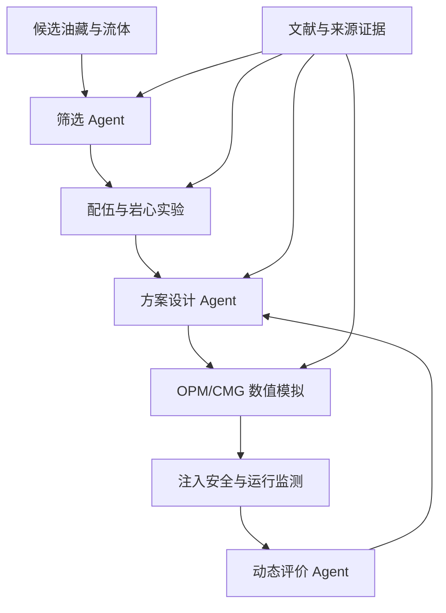

# PetroAgent M1

面向石油工程科研的第一阶段智能体内核。项目以 OPM 官方开放案例
`polymer_simple2D` 为主案例，以 `SPE9` 为跨场景验证案例，先建立一个
可测试、可追溯、可替换数据源的确定性分析底座，并在同一项目中建设
`PetroleumEngineeringCoreOntology v0.2`（石油工程核心本体 v0.2），并提供
YAML 到 Neo4j 的可重复导入与查询适配层。

> 当前版本：`PetroAgent v0.3.0 / Knowledge Foundation v0.2.0`  
> Python：`3.10+`  
> 当前边界：确定性分析内核＋YAML知识源＋Neo4j存储/查询；不包含 LLM、RAG、
> Web 前端和自动运行模拟器。

### v0.2.0 与前一版的区别

| 能力 | 前一版（M1.1 / v0.1.x） | v0.2.0 |
|---|---|---|
| 规则来源 | Python 硬编码规则 | 8 条 YAML 基础规则已接入执行管线 |
| 聚合物驱知识 | 仅有领域包与少量校验 | 25 条分阶段领域决策规则 |
| 关系表达 | 程序结构中的隐式关系 | 17 条可审查的实体—参数—约束关系 |
| 执行模式 | 仅旧规则 | `knowledge`、`legacy`、`hybrid` |
| 规则追溯 | 主要记录程序结果 | 记录规则来源、适用条件和证据元数据 |
| Demo 输出 | 显示旧规则总数 | 显示知识库版本及加载、执行、跳过数量 |
| Neo4j | 无 | 仍未接入；YAML 图谱可在后续版本导入 |

因此，v0.2.0 的交付边界是“聚合物驱 YAML 知识图谱源＋确定性规则执行”。
v0.3.0 在不改变 YAML 事实来源的前提下，增加 Neo4j 导入、Cypher 查询及
Browser 可视化支持。

### v0.3.0 Neo4j 接入与中文化

v0.3.0 的主入口仍是 `scripts/run_demo.py`。Neo4j 是 YAML 知识源的派生存储，
不是第二套需要人工维护的知识库。

本版完成：

- 将93个概念节点、25条规则、6个阶段和7个来源导入 Neo4j；
- 将17条聚合物驱领域三元组导入 Neo4j；
- 为 `Concept`、`Domain`、`Rule`、`Stage`、`Source` 节点保存 `name_zh`；
- 为领域关系及 `HAS_RULE`、`IN_STAGE`、`SUPPORTED_BY`、`USES_INPUT`
  等结构关系保存 `name_zh`；
- 终端默认以“中文名 `[稳定ID]`”输出，兼顾阅读和程序核验；
- 使用 `MERGE` 和唯一约束实现可重复导入，不主动清空数据库。

中文化不会把 `concept_id`、`rule_id` 或 Neo4j 标签/关系类型改成中文。例如：

```text
聚合物溶液黏度 [polymer_solution_viscosity]
--影响 [AFFECTS]-->
流度比 [mobility_ratio]
```

英文 ID 是跨 YAML、Python、Cypher 和外部数据映射的稳定标识；`name_zh`
才是终端、报告和图形界面的首选展示名。

## 1. 项目目标

M1 解决的不是“让大模型自由分析油藏”，而是先打通一条可审计链路：

```text
OPM Deck / OPM 导出 CSV
        ↓
数据源适配与统一字段
        ↓
参数、单位和概念对齐
        ↓
确定性指标计算
        ↓
知识规则检索＋确定性规则执行
        ↓
带来源的科研曲线与 Markdown 报告
```

项目遵循两条边界：

1. **确定性分析内核负责计算**：数据读取、指标计算、数值判断、绘图和报告；
2. **知识基础层负责语义与证据**：实体、关系、参数、单位、规则、适用条件和来源。

知识图谱不会代替数值模拟和确定性计算，大模型也不会被当作数值证据。

第一版正式数据来源为：

| 案例 | 上游仓库 | 本项目用途 |
|---|---|---|
| `polymer_simple2D` | `OPM/opm-tests` | 聚合物驱主案例，验证化学驱领域包 |
| `SPE9` | `OPM/opm-data` | 黑油/水驱跨案例，验证核心层不依赖聚合物 |

上游数据不会伪装成项目自有数据。下载脚本会记录仓库、提交哈希和子目录。
请同时遵守上游仓库的许可证和通知。

## 2. 已完成能力

- 统一科研数据对象 `CanonicalDataset`；
- 标准 CSV 字段映射和必需字段检查；
- Eclipse/OPM Deck 的 `INCLUDE` 依赖扫描与关键词概览；
- 公共油藏指标计算：含水率、累计产油量、注入 PV（元数据足够时）；
- 聚合物驱领域包：聚合物阶段识别和浓度非负检查；
- 通用规则：时间顺序、非负流量、含水率边界、采收率边界与单调性；
- 自动生成油率、含水率、采收率、注入井 BHP、聚合物浓度曲线；
- 自动生成带来源、规则状态和解释限制的 Markdown 报告；
- CLI 命令、演示数据、单元测试和端到端测试；
- OPM 两个官方案例的稀疏下载脚本。
- 石油工程上层实体、通用关系、参数和单位的 YAML 定义；
- 全部实体与关系的中文、英文对照名称；
- `YamlKnowledgeService` 概念解析、数据集对齐、规则检索和来源追溯；
- YAML 驱动的通用规则执行器；
- 聚合物驱首个领域子图谱；
- 报告中的观测值、期望值、来源和适用条件。

## 3. 目录结构

```text
petro-agent-m1/
├── knowledge_graph/                  # 可审查、可版本管理的知识源
│   ├── core/                         # 上层实体、关系、参数、单位、规则
│   ├── domains/chemical_eor/         # 首个聚合物驱验证子图谱
│   ├── mappings/                     # 标准字段、OPM、未来CMG映射
│   ├── provenance/                   # 来源与证据
│   └── standards/                    # 标准目录骨架
├── config/cases/                    # 每个案例的字段、单位和领域包配置
│   ├── polymer_simple2d.yaml
│   └── spe9.yaml
├── data/
│   ├── raw/                         # OPM 原始案例，默认不提交 Git
│   ├── processed/                   # 标准化结果，默认不提交 Git
│   └── demo/                        # 仅用于管线测试的明确标注演示数据
├── outputs/
│   ├── figures/
│   ├── reports/
│   └── runs/
├── scripts/
│   ├── fetch_opm_data.py            # 下载官方案例并记录上游修订号
│   ├── import_neo4j.py               # 幂等导入 YAML 图谱
│   ├── query_neo4j.py                # 查询并输出 Neo4j 关系
│   └── run_demo.py
├── src/petro_agent/
│   ├── adapters/                    # CSV、Deck、未来 OPM/CMG/实验数据适配器
│   ├── core/                        # 与石油工程具体方向无关的协议和管线
│   ├── knowledge/                   # YAML知识服务、规则执行、Neo4j适配层
│   ├── domain_packs/
│   │   ├── common_reservoir/        # 公共油藏规则与计算
│   │   └── polymer_flooding/        # 聚合物驱专用逻辑
│   ├── reporting/                   # 图表与报告
│   ├── validators/                  # 确定性校验
│   ├── cli.py
│   └── pipeline.py
├── tests/
├── .env.example
├── pyproject.toml
└── README.md
```

`knowledge_graph/` 和 `src/petro_agent/knowledge/` 必须分开：

- `knowledge_graph/` 保存研究人员可直接审查的知识内容；
- `src/petro_agent/knowledge/` 保存加载、检索、匹配和执行知识的程序；
- Neo4j 是查询和关系遍历载体，Git 中的 YAML 仍是可追溯的知识源。

## 4. 快速开始

### 4.1 Windows PowerShell

```powershell
cd F:\Projects\petro-agent-m1
py -3.10 -m venv .venv
.\.venv\Scripts\Activate.ps1
python -m pip install --upgrade pip
python -m pip install -e ".[dev]"
pytest
python scripts\validate_knowledge.py
python scripts\run_demo.py
```

如需使用清华镜像：

```powershell
python -m pip install -e ".[dev]" -i https://pypi.tuna.tsinghua.edu.cn/simple
```

### 4.2 macOS / Linux

```bash
cd petro-agent-m1
python3.10 -m venv .venv
source .venv/bin/activate
python -m pip install --upgrade pip
python -m pip install -e ".[dev]"
pytest
python scripts/validate_knowledge.py
python scripts/run_demo.py
```

成功后会生成：

```text
outputs/reports/polymer_simple2d_demo.md
outputs/runs/polymer_simple2d_demo_canonical.csv
outputs/figures/polymer_simple2d_demo_*.png
```

演示 CSV 是为了离线验证代码而人工构造的平滑数据，配置中明确标为
`generated_demo_not_official_opm_output`。它不能作为论文实验结果，
正式分析必须替换成 OPM Flow 实际输出。

## 5. 导入并验证 Neo4j 图谱

项目根目录 `.env` 应包含：

```env
NEO4J_URI=bolt://localhost:7687
NEO4J_USER=neo4j
NEO4J_PASSWORD=你的密码
NEO4J_DATABASE=petro
```

先只校验 YAML 和统计导入计划，不连接数据库：

```powershell
python scripts\import_neo4j.py --dry-run
```

确认无误后执行幂等导入；重复运行不会重复创建同一节点和关系：

```powershell
python scripts\import_neo4j.py
python scripts\query_neo4j.py
```

也可以让聚合物驱 Demo 直接从 Neo4j 输出关系佐证：

```powershell
python scripts\run_demo.py --graph-source neo4j
```

默认 `python scripts\run_demo.py` 仍读取 YAML；这便于比较 YAML 事实来源与
Neo4j 派生存储是否一致。

### 5.1 已导入旧版数据时的中文升级

如果已经运行过中文化之前的 `v0.3.0` 导入脚本，无需删除数据库。拉取新代码后
重新执行：

```powershell
python scripts\import_neo4j.py --dry-run
python scripts\import_neo4j.py
```

导入器会通过稳定 ID 命中原节点和关系，并补写 `name_zh`、`name_en` 等属性。
随后验证：

```powershell
python scripts\query_neo4j.py
python scripts\run_demo.py --graph-source neo4j
```

预期关系输出形式：

```text
01. 聚合物驱 [polymer_flooding]
    --是一种 [IS_A]-->
    化学提高采收率方法 [chemical_eor_method]
```

### 5.2 中文属性完整性检查

检查所有项目节点是否均有中文名：

```cypher
MATCH (n)
WHERE n:Concept OR n:Domain OR n:Rule OR n:Stage OR n:Source
WITH n,
     CASE
       WHEN n:Concept THEN n.concept_id
       WHEN n:Domain THEN n.domain_id
       WHEN n:Rule THEN n.rule_id
       WHEN n:Stage THEN n.stage_id
       WHEN n:Source THEN n.source_id
     END AS stable_id
WHERE n.name_zh IS NULL OR trim(n.name_zh) = ''
RETURN labels(n) AS labels, stable_id
ORDER BY labels, stable_id;
```

正确结果应为：

```text
no changes, no records
```

检查所有项目关系是否有中文名：

```cypher
MATCH ()-[r]->()
WHERE r.source = 'knowledge_graph YAML'
   OR type(r) IN ['HAS_RULE', 'IN_STAGE', 'SUPPORTED_BY', 'USES_INPUT']
WITH r
WHERE r.name_zh IS NULL OR trim(r.name_zh) = ''
RETURN type(r) AS relation_id, count(*) AS missing_count;
```

正确结果同样应为空。

### 5.3 Neo4j Browser 中文展示

Neo4j 内部标签（如 `Concept`）和关系类型（如 `AFFECTS`）继续使用稳定英文标识。
在图形样式设置中，将节点 caption/标题属性设为 `name_zh`，将关系 caption/标题
属性设为 `name_zh`，即可优先显示中文。若当前 Browser 版本不支持关系属性作为
标题，可使用下面的表格查询查看完整中英文对照：

```cypher
MATCH (a:Concept)-[r]->(b:Concept)
RETURN a.name_zh AS 起点,
       coalesce(r.name_zh, type(r)) AS 关系,
       b.name_zh AS 终点,
       a.concept_id AS 起点ID,
       type(r) AS 关系ID,
       b.concept_id AS 终点ID
ORDER BY 起点ID, 关系ID, 终点ID;
```

在 Neo4j Browser 中查看聚合物驱概念子图：

```cypher
MATCH path=(a:Concept)-[r]->(b:Concept)
RETURN path
LIMIT 200;
```

查看25条规则及其阶段和证据：

```cypher
MATCH path=(d:Domain)-[:HAS_RULE]->(r:Rule)-[:IN_STAGE|SUPPORTED_BY]->(x)
RETURN path
LIMIT 200;
```

导入器只使用 `MERGE` 和唯一约束，不会清空 `petro` 数据库。如果数据库中已有
其他项目数据，也不会被脚本删除。YAML 内容更新后重新运行导入脚本即可增量同步；
当前版本不会自动删除已从 YAML 移除的旧节点。

### 5.4 常用命令总览

| 命令 | 作用 | 是否访问 Neo4j |
|---|---|---:|
| `python scripts\validate_knowledge.py` | 校验 YAML 知识文件 | 否 |
| `python scripts\import_neo4j.py --dry-run` | 生成并检查导入计划 | 否 |
| `python scripts\import_neo4j.py` | 幂等写入 `petro` | 是 |
| `python scripts\query_neo4j.py` | 单独查询中文图谱关系 | 是 |
| `python scripts\run_demo.py` | 执行规则并从 YAML 输出关系 | 否 |
| `python scripts\run_demo.py --graph-source neo4j` | 执行规则并从 Neo4j 输出关系 | 是 |
| `python scripts\run_demo.py --graph-source none` | 仅执行规则和生成报告 | 否 |

## 6. 获取 OPM 官方案例

机器需安装 Git，并能够访问 GitHub。

```bash
python scripts/fetch_opm_data.py polymer_simple2D spe9
```

结果默认写入：

```text
data/raw/polymer_simple2D/
data/raw/spe9/
```

每个目录会附加 `UPSTREAM_REVISION.txt`，记录：

- 上游仓库；
- Git 提交哈希；
- 提取的子目录。

脚本在目标目录已存在时会停止，避免静默覆盖研究数据。

也可分别下载：

```bash
python scripts/fetch_opm_data.py polymer_simple2D
python scripts/fetch_opm_data.py spe9
```

## 6. 检查 OPM/Eclipse Deck

找到案例主 `.DATA` 文件后运行：

```bash
petro-agent inspect-deck --input data/raw/polymer_simple2D/CASE.DATA
```

将 `CASE.DATA` 替换成该目录中实际主文件名。命令输出：

- 根文件绝对路径；
- 递归访问的 INCLUDE 文件；
- 发现的关键词；
- 缺失的 INCLUDE 文件。

这一步只检查输入组织和依赖完整性，不运行数值模拟，也不证明模型物理正确。

## 7. 接入 OPM Flow 实际结果

当前 M1 不绑定某个 OPM 版本或二进制输出解析库。推荐先用你安装的
OPM Flow 运行案例，再将 summary/well 结果导出为 CSV，映射到以下标准字段。

| 标准字段 | 单位 | 必需 | 常见来源含义 |
|---|---:|---:|---|
| `time_days` | day | 是 | 模拟时间 |
| `injected_pv` | PV | 否 | 累计注入孔隙体积 |
| `oil_rate_m3_day` | m³/day | 聚合物演示必需 | 总/选定生产井油率 |
| `water_rate_m3_day` | m³/day | 聚合物演示必需 | 总/选定生产井水率 |
| `water_cut_fraction` | fraction | 否 | 可由油水流量计算 |
| `cumulative_oil_m3` | m³ | 否 | 可由油率和时间近似积分 |
| `recovery_factor_fraction` | fraction | 否 | 累计产油量 / OOIP |
| `injector_bhp_bar` | bar | 否 | 注入井井底压力 |
| `polymer_concentration_kg_m3` | kg/m³ | 否 | 注入或生产聚合物浓度 |
| `cumulative_injected_water_m3` | m³ | 否 | 配合孔隙体积计算注入 PV |

如果导出列名不同，在 YAML 中配置映射，不要修改核心代码：

```yaml
column_mapping:
  TIME: time_days
  FOPR: oil_rate_m3_day
  FWPR: water_rate_m3_day
  FWCT: water_cut_fraction
```

注意：OPM summary 关键字可能是现场总量或单井量，单位也受 deck 单位制和
导出工具影响。上面的映射只是结构示例，必须先核实实际结果的对象、符号和单位。

准备好 CSV 后运行：

```bash
petro-agent analyze \
  --input data/processed/polymer_simple2d_result.csv \
  --config config/cases/polymer_simple2d.yaml \
  --output outputs
```

SPE9 使用：

```bash
petro-agent analyze \
  --input data/processed/spe9_result.csv \
  --config config/cases/spe9.yaml \
  --output outputs
```

## 8. 统一数据协议

所有数据源最终都转换成 `CanonicalDataset`：

```python
CanonicalDataset(
    case_id="polymer_simple2d",
    domain="reservoir_engineering",
    process="polymer_flooding",
    frame=dataframe,
    units={"time_days": "day"},
    source=SourceInfo(
        source_type="opm_flow_export",
        model="polymer_simple2D",
        source_files=["result.csv"],
        repository="https://github.com/OPM/opm-tests",
        revision="<commit sha>",
    ),
    metadata={},
)
```

核心分析只依赖标准字段，不依赖 `FOPR`、`FWCT`、`WBHP` 或 CMG 的原始字段。
以后接入 CMG、实验 Excel、Volve、钻井数据时，应新增适配器或领域包，而不是
在核心工作流中堆叠条件判断。

## 9. 知识基础层 v0.2

### 9.1 中英文实体约定

所有正式实体至少包含稳定 ID、中文名和英文名：

```yaml
- concept_id: reservoir
  concept_type: asset
  name_zh: 油气藏
  name_en: Reservoir
  aliases_zh:
    - 储层
```

`concept_id` 是程序、数据映射和未来 Neo4j 使用的稳定标识，不随显示语言改变。
中文和英文名称用于科研阅读、检索、报告与图形化展示。别名必须按语言分开存储，
避免把中文、英文缩写和源系统字段混在一个不可审查的列表里。

首版上层实体包括：

| 稳定 ID | 中文名 | 英文名 |
|---|---|---|
| `domain` | 工程领域 | Engineering Domain |
| `asset` | 工程资产 | Engineering Asset |
| `formation` | 地层 | Formation |
| `reservoir` | 油气藏 | Reservoir |
| `well` | 井 | Well |
| `wellbore` | 井筒 | Wellbore |
| `material` | 工程材料 | Engineering Material |
| `fluid` | 流体 | Fluid |
| `equipment` | 设备 | Equipment |
| `operation` | 工程作业 | Engineering Operation |
| `method` | 工程方法 | Engineering Method |
| `parameter` | 工程参数 | Engineering Parameter |
| `unit` | 计量单位 | Measurement Unit |
| `dataset` | 数据集 | Dataset |
| `model` | 工程模型 | Engineering Model |
| `software` | 软件工具 | Software Tool |
| `standard` | 标准 | Standard |
| `standard_clause` | 标准条款 | Standard Clause |
| `rule` | 工程规则 | Engineering Rule |
| `evidence` | 证据 | Evidence |
| `organization` | 组织机构 | Organization |
| `research_task` | 科研任务 | Research Task |

### 9.2 中英文关系约定

关系同样不得只写英文：

```yaml
- relation_id: HAS_PARAMETER
  name_zh: 具有参数
  name_en: Has Parameter
```

存在明确反向语义时，可同时声明中英文反向名称。例如：

```yaml
- relation_id: PART_OF
  name_zh: 是其组成部分
  name_en: Part Of
  inverse_name_zh: 包含组成部分
  inverse_name_en: Has Part
```

首版关系包括 `IS_A / 是一种`、`属于工程领域 / Belongs To Domain`、
`作用于 / Acts On`、`使用材料 / Uses Material`、`具有参数 / Has Parameter`、
`使用单位 / Uses Unit`、`约束 / Constrains`、`来源于 / Derived From`、
`由其支持 / Supported By`、`适用于 / Applies To` 和
`映射自 / Mapped From` 等。完整定义见
`knowledge_graph/core/relations.yaml`。

### 9.3 参数与标准字段映射

案例 YAML 负责说明实际数据如何进入管线；核心知识文件负责说明字段的工程含义：

```text
原始字段 FOPR
    → 案例/OPM映射 oil_rate_m3_day
    → 图谱概念 oil_production_rate
    → 中文名 产油速率 / 英文名 Oil Production Rate
    → 标准单位 m3/day
```

这种分层保证 OPM、CMG、实验 Excel 和其他数据源可以共用同一概念。CMG 映射
当前保留为空模板；在确认具体模拟器模块、导出格式和单位制前不做猜测映射。

### 9.4 知识服务接口

当前实现为 `YamlKnowledgeService`，提供：

```python
resolve_concept(term)
resolve_dataset(dataset)
find_rules(concept_id, context)
trace_evidence(rule_id)
```

未来的 `Neo4jKnowledgeService` 必须遵循同一接口。分析管线不应知道规则来自
YAML、Neo4j、标准目录还是其他知识载体。

### 9.5 当前联合执行链路

```text
CSV Adapter
→ CanonicalDataset
→ 领域包确定性指标计算
→ 字段与中英双语概念对齐
→ 按 domain/process/representation 检索适用规则
→ RuleEngine 确定性执行
→ 带来源和适用条件的 ValidationFinding
→ Markdown 报告
```

案例可通过以下配置启用知识层：

```yaml
knowledge:
  enabled: true
  execution_mode: knowledge
  context:
    representation: decimal_fraction
```

`execution_mode` 支持三种模式：

| 模式 | 执行规则 | 适用场景 |
|---|---|---|
| `knowledge` | 仅执行 YAML 知识规则 | 默认模式，用于新版演示和正式扩展 |
| `legacy` | 仅执行原 Python 规则 | 与 M1 原始行为对照或回归排查 |
| `hybrid` | 两类规则均执行，并移除已迁移的旧规则 | 迁移期保留尚未知识化的复杂 Python 规则 |

当模式为 `knowledge` 或 `hybrid` 时，知识目录缺失会直接报错，不再静默退回旧
规则。目标概念无法映射到数据字段的规则会被记为“跳过”，并写入
`dataset.metadata["rule_execution"]`，避免把“没有执行”误认为“校验通过”。

执行 `python scripts/run_demo.py` 后，终端会明确显示：

```text
规则执行模式: knowledge
知识库版本: Knowledge Foundation v0.2
知识规则: 加载 8 条, 执行 8 条, 跳过 0 条
校验结果: 通过 8 条, 未通过 0 条
```

如需隔离排查旧管线，应同时设置：

```yaml
knowledge:
  enabled: false
  execution_mode: legacy
```

## 10. 校验规则

规则分为“当前可执行规则”和“领域决策规则目录”，两者不能混为一谈。

### 10.1 当前可执行规则

`python scripts/run_demo.py` 当前直接执行以下逐列数据质量和物理边界规则：

| 规则 ID | 作用 |
|---|---|
| `CORE-DATA-001` | 数据集不能为空 / Dataset Must Not Be Empty |
| `CORE-TIME-001` | 模拟时间单调不减 / Simulation Time Monotonic |
| `CORE-PROD-001/002` | 油率、水率非负 / Non-negative Production Rates |
| `CORE-PROD-003` | 含水率位于 `[0, 1]` / Valid Water Cut Range |
| `CORE-RECOVERY-001` | 采收率位于 `[0, 1]` / Valid Recovery Factor Range |
| `CORE-RECOVERY-002` | 采收率单调不减 / Monotonic Recovery Factor |
| `EOR-POLYMER-001` | 聚合物浓度非负 / Non-negative Polymer Concentration |
| `POLYMER_COLUMN_PRESENT` | 提醒聚合物案例是否存在浓度字段 |

规则分为 `error` 和 `warning`。当前报告会完整记录所有规则；CLI 不会仅凭一条
warning 判定整个科研结论失败。

下一步应增加：

- 网格饱和度边界；
- `So + Sw (+ Sg) ≈ 1`；
- 聚合物质量守恒误差；
- 注入端到生产端压力合理性；
- 井控约束是否生效；
- 水驱/聚合物驱的同条件配对检查；
- 相渗、PVT 和单位一致性检查。

基础规则已从 Python 硬编码迁移至 `knowledge_graph/core/rules.yaml`。
无法安全声明为简单比较运算的复杂领域校验仍可留在 Python 中，但必须返回唯一
规则 ID，避免与 YAML 规则重复。

来源类型分为项目内部数据质量定义、基础数学/物理约束、正式标准、论文或其他
证据。当前 `petroleum_engineering_core` 只表示不依赖特定标准版本的基础约束，
**不冒充行业标准或标准条款**。

### 10.2 聚合物驱领域规则目录

`knowledge_graph/domains/chemical_eor/polymer_flooding.yaml` 收录了首版聚合物驱
领域规则目录，覆盖从候选油藏到现场评价的完整决策链。它不是把论文中的一句话
直接变成“硬阈值”，而是记录规则类型、输入、逻辑、决策强度和证据来源。

| 阶段 | 规则 ID | 当前覆盖 |
|---|---|---|
| 候选筛选 | `PF-SCREEN-*` | 油黏度、渗透率、温度、水驱波及基础、多参数联合判断 |
| 配伍与实验 | `PF-LAB-*` | 盐水配伍、黏浓关系、剪切、热稳定、RF/RRF、吸附 |
| 方案设计 | `PF-DESIGN-*` | 流度控制、浓度与段塞联合优化、聚合物质量守恒 |
| 数值模拟 | `PF-SIM-*` | 黏度、吸附、不可进入孔隙体积、渗透率降低、非牛顿效应 |
| 注入运行 | `PF-OPS-*` | 破裂压力裕度、注入能力基线、地面—井口浓度闭合 |
| 动态评价 | `PF-PERF-*` | 水驱基线、聚合物利用率、预测—实测时间序列校验 |

传统筛选文献常见的参考边界包括：

| 参数 | 传统筛选参考 | 在本项目中的用法 |
|---|---:|---|
| 地层原油黏度 | `< 150 cP` | `advisory`，不可单参数否决 |
| 平均渗透率 | `> 10 mD` | `advisory`，需结合分子尺寸和注入实验 |
| 油藏温度 | `< 93.33 °C`（约 200 °F） | `advisory`，耐温能力由老化实验校准 |
| 水驱平面波及系数 | `> 0.5` | `advisory`，用于判断流度控制的应用基础 |

这些边界来自传统筛选和更新筛选研究，不是跨聚合物类型、跨油藏条件通用的
物理定律。高黏油、高温或低渗项目不能仅因超出一项边界被自动否决，必须进入
配伍、流变、岩心驱替、注入能力和经济性证据链。

### 10.3 聚合物驱智能体图谱

首版智能体不是一个自由对话机器人，而是围绕下列图谱组织证据和工具调用：



图谱中的主要因果关系是：

```text
聚合物浓度 → 溶液黏度 → 流度比 → 波及效率
温度/盐度/二价离子 → 聚合物稳定性与黏度保持
剪切速率 → 表观黏度与机械降解
吸附/滞留/不可进入孔隙体积 → 聚合物运移
残余阻力系数 → 水相渗透率降低 → 注入能力与波及
注入压力 < 破裂压力 − 安全裕度
实际产油 − 水驱基线 → 聚合物增油量
聚合物质量 / 增油量 → 聚合物利用率
```

建议的智能体职责边界如下：

| Agent | 输入 | 调用的确定性工具 | 输出 |
|---|---|---|---|
| Screening Agent | 油藏、流体、温度、渗透率 | 单位转换、筛选规则、证据查询 | `推荐/条件推荐/证据不足` |
| Lab Evidence Agent | 盐水、聚合物、流变与岩心数据 | 曲线检查、RF/RRF、黏度保持率 | 配伍与注入风险清单 |
| Design Agent | 目标流度比、浓度、段塞、成本 | 质量守恒、情景比较、优化器 | 候选注入方案 |
| Simulation Agent | Deck、PVT、相渗、聚合物参数 | OPM/CMG 适配器、模型完整性检查 | 可复现实验与敏感性结果 |
| Operations Agent | 注压、注量、浓度、井口数据 | 压力裕度、基线对比、异常检测 | 降配/停注/复核建议 |
| Evaluation Agent | 实测与水驱基线 | 增油、利用率、误差与偏差计算 | 可追溯效果评价 |

大模型只负责解释任务、选择受控工具、组织证据和生成待审核建议；阈值判断、
公式计算、模拟运行和最终数值必须由确定性代码完成。每次决策至少应返回：

```text
decision + rule_id + observed_value + expected_value
+ applicability + source_id + uncertainty + missing_evidence
```

### 10.4 来源与证据等级

首版主要来源包括：

- Al-Adasani 与 Bai（2014）的更新聚合物驱筛选分析；
- Taber 等（1997）的传统 EOR 筛选准则；
- Seright（2017）的浓度、黏度和段塞设计研究；
- Seright 等（2009）的聚合物注入能力研究；
- OPM Flow 2023.04 官方聚合物模型参考手册。

具体 DOI、URL、出版方和使用限制记录在
`knowledge_graph/provenance/sources.yaml`。项目使用以下决策强度：

| 决策强度 | 含义 |
|---|---|
| `hard_constraint` | 数学、质量守恒或安全边界，满足输入条件时可直接判定 |
| `required_evidence` | 进入下一阶段前必须提供对应实验或数据 |
| `model_integrity` | 数模参数必须标定，或明确禁用并说明理由 |
| `advisory` | 文献经验筛选参考，不得单独作为淘汰依据 |
| `project_specific` | 阈值必须由本项目实验、现场约束或专家审批给出 |
| `optimization` | 需要比较多个情景，不存在脱离目标函数的唯一答案 |

### 10.5 当前执行边界

领域目录中的规则不是全部都已由 `run_demo.py` 执行。当前演示 CSV 缺少温度、
盐度、油黏度、渗透率、吸附、RF/RRF、破裂压力和经济数据，因此：

- `CORE-*` 与 `EOR-POLYMER-001` 已可直接执行；
- `PF-*` 已形成可检索、可追溯的决策图谱；
- 后续需要扩展标准字段和算子，才能把对应 `PF-*` 逐批转为可执行规则；
- 没有输入证据的规则必须返回 `missing_evidence`，不能默认为“通过”。

因此，当前 Demo 的正确定位是“聚合物驱规则驱动智能体初版”，不是已经能够
替代聚合物筛选实验、油藏模拟或专家审批的自动决策系统。

## 11. 如何扩展到其他石油工程方向

### 新增数据源

实现 `DatasetAdapter` 协议：

```python
class DatasetAdapter(Protocol):
    def load(self, source: Path, config: dict) -> CanonicalDataset:
        ...
```

适合新增：

- `OpmSummaryAdapter`
- `CmgResultAdapter`
- `ExperimentalExcelAdapter`
- `VolveProductionAdapter`

### 新增领域包

实现 `DomainPack` 的 `enrich` 和 `validate`：

```python
class DrillingPack:
    name = "drilling"

    def enrich(self, dataset):
        return dataset

    def validate(self, dataset):
        return []
```

然后在 `pipeline.py` 注册，并在案例 YAML 中声明：

```yaml
domain_packs:
  - drilling
```

可以按同一方式加入：

- 水驱；
- 气驱和 CO₂-EOR；
- CO₂ 地质封存；
- 生产工程；
- 钻井工程；
- 完井工程；
- 井网优化。

### 新增实体、关系或规则

1. 为对象选择稳定、语言无关的 `concept_id` 或 `relation_id`；
2. 同时填写 `name_zh` 与 `name_en`；
3. 参数需声明标准单位，并加入 `canonical_fields.yaml` 映射；
4. 规则必须声明唯一 ID、类型、目标概念、运算符、级别和来源；
5. 有适用前提时，同时写入 `conditions` 和中英文适用范围；
6. 运行 `python scripts/validate_knowledge.py` 和 `pytest -q`；
7. 正式标准必须在 `standards/catalog.yaml` 中记录版本与发布机构。

第一版规则引擎支持：

- `not_empty`
- `between`
- `greater_than_or_equal`
- `monotonic_non_decreasing`

复杂公式不要用字符串 `eval` 写进 YAML，应保留为经过测试的 Python 执行器。

## 12. 测试

运行全部测试：

```bash
pytest -q
```

当前覆盖：

- 含水率和累计油计算；
- 含水率越界识别；
- 采收率单调性；
- Deck INCLUDE 递归扫描；
- 从 CSV 到图表、标准化结果和报告的端到端链路。
- 中文、英文概念名称解析；
- YAML规则检索、执行和来源回溯。

科研规则新增时，必须同步添加：

1. 正常样例；
2. 边界值；
3. 明确失败样例；
4. 单位或缺列异常样例。

## 13. 输出的可追溯性

当前报告会记录数据来源类型、模型、仓库、行数、摘要、规则结果和图表。
正式研究运行还应额外保存：

- 原始 deck 与哈希；
- OPM Flow 版本和启动命令；
- 操作系统与依赖锁定文件；
- 输出提取脚本及参数；
- 上游仓库 commit；
- 字段映射与单位确认人；
- 对照实验参数差异；
- 每次运行的唯一 `run_id`。

项目不会把“LLM 的合理解释”当成数值校验。未来接入 LLM 后，报告应明确区分：

- 数据直接事实；
- 确定性公式结果；
- 校验规则结论；
- 文献支持解释；
- LLM 推断与待验证假设。

## 14. 后续路线

### M1.1（已完成）

- OPM 案例注册；
- 统一协议；
- CSV 分析；
- 规则校验；
- 图表和报告。

### M1.2（当前：知识基础层 v0.2）

- 石油工程上层实体与中英双语关系；
- 参数、单位、来源和规则格式；
- YAML知识服务与规则执行器；
- 标准字段概念映射；
- 聚合物驱首个验证子图谱；
- 聚合物驱 25 条分阶段领域规则目录；
- 聚合物驱六类受控 Agent 职责图谱；
- 报告证据追溯。

### M1.3（当前：Neo4j 图谱接入 v0.3）

- YAML 到 Neo4j 的幂等导入；
- 概念、领域、规则、阶段、输入参数和证据来源节点；
- 唯一约束和重复导入保护；
- Python 查询服务、文本关系佐证和 Browser 可视化；
- YAML dry-run 校验，Neo4j 继续作为派生查询存储。

### M1.4

- 安装并自动调用 OPM Flow；
- 直接读取 summary / restart 输出；
- 建立水驱与聚合物驱成对运行配置；
- 增加运行清单和完整 provenance。

### M1.5

- 扩充标准目录、条款和版本关系；
- 增加知识结构 Schema 校验；
- 增加 OPM 结果字段与单位的版本化映射；
- 增加多跳查询与智能体知识检索接口。

### M2

- 文献与官方文档 RAG；
- LangGraph 受控工作流；
- 工具选择、人工确认、失败重试；
- FastAPI 上传与任务接口。

### M3

- CMG STARS 适配器；
- 参数扫描和实验设计；
- 代理模型；
- 贝叶斯优化或进化算法；
- 最后才考虑强化学习与复杂多智能体。

## 15. 当前限制

- 仓库内的演示 CSV 不是 OPM 官方模拟输出；
- 尚未自动安装或运行 OPM Flow；
- 尚未直接解析 EGRID/UNRST/SMSPEC 等二进制结果；
- 累计产油量当前使用离散矩形积分，正式工作可替换为模拟器累计量；
- 未知 OOIP 时不会自动推导采收率；
- 未实现完整质量守恒；
- 未接入 LLM，不具备自然语言自主规划；
- 知识实体、关系和规则仍是 v0.2 研究演示版，并非完备行业知识库；
- 已登记论文和官方软件手册来源，但尚未导入正式标准全文及可定位条款；
- Neo4j 已支持导入、基础查询和图形化浏览，但尚未接入分析管线的规则执行；
- CMG 字段映射尚未在具体导出结果上验证；
- 未接入前端。

这些限制是刻意的：第一阶段先保证计算工具、接口、规则和来源可验证，
再把智能体能力放在可靠内核外层。

## 16. 建议的首次正式实验

1. 下载 `polymer_simple2D` 和 `SPE9`；
2. 检查两个案例的主 Deck 和 INCLUDE 完整性；
3. 在固定 OPM Flow 版本下分别运行；
4. 保留原始输出和运行命令；
5. 编写一个版本固定的结果导出适配器；
6. 将 `polymer_simple2D` 拆成水驱基线与聚合物方案；
7. 用相同终止时间或注入 PV 对齐；
8. 比较油率、含水率、累计油、采收率和注入井 BHP；
9. 增加饱和度与聚合物质量守恒规则；
10. 生成第一份可重复的正式分析报告。

完成这十步后，再接入 LangGraph。这样 Agent 调用的是已经验证的科研工具，
而不是临时生成未经检验的计算代码。

## 17. 日后更换数据源的方法

当前项目中的演示 CSV 只用于验证“读取数据 → 标准化 → 规则执行 → 绘图 →
生成报告”这条管线能够运行，不应把演示文件路径、列名或案例名称继续写死在
规则引擎中。日后接入 OPM 实际输出、CMG 导出文件、实验数据、数据库或外部
API 时，应保持分析内核不变，只替换数据源适配层和案例配置。

推荐始终保持以下分层：

```text
原始数据源
  CSV / Excel / OPM / CMG / 实验数据 / 数据库 / API
        ↓
数据源适配器（读取文件、识别字段、处理格式差异）
        ↓
字段与单位映射（转换为稳定英文 concept_id）
        ↓
CanonicalDataset（项目统一数据对象）
        ↓
校验、指标计算、知识检索、规则执行、绘图和报告
```

其中：

- 原始数据源可以变化；
- `CanonicalDataset` 的字段语义应尽量保持稳定；
- 规则和知识图谱应引用稳定的 `concept_id`，不直接依赖某个文件的中文表头；
- 单位换算必须在适配或标准化阶段完成，不能留给 LLM 猜测；
- 原始文件应保留，不要用清洗后的结果覆盖原文件；
- 每次正式运行都应记录数据来源、文件哈希、适配器版本、单位和运行时间。

### 17.1 替换为另一份 CSV 或 Excel

如果新文件表达的仍是同一类时序结果，优先新增案例配置，而不是修改通用规则。
建议在 `config/cases/` 中增加一个配置文件，例如：

```text
config/cases/my_polymer_case.yaml
```

配置至少应描述：

```yaml
case_id: my_polymer_case
domain_pack: polymer_flooding
source_type: excel
source_file: data/raw/my_polymer_case.xlsx
sheet_name: Summary

column_mapping:
  日期: time
  日产油量: oil_rate
  日产水量: water_rate
  注入井底压力: injection_bhp
  聚合物浓度: polymer_concentration

units:
  time: day
  oil_rate: m3/day
  water_rate: m3/day
  injection_bhp: MPa
  polymer_concentration: mg/L
```

上例左侧是上传文件中的真实列名，右侧是项目内部的标准字段。实际配置项应以
项目当前的 case schema 为准，不要仅复制示例后跳过校验。

如果现有 CSV 适配器已经能够读取该格式，只需：

1. 将原始文件放入 `data/raw/`；
2. 新建案例配置并填写字段、单位和领域包；
3. 运行字段完整性与单位检查；
4. 使用新 `case_id` 调用现有管线；
5. 检查 `outputs/runs/` 中的标准化数据，再查看报告。

Excel 数据需要新增或完善 `ExcelAdapter`，负责选择工作表、处理空表头、日期
格式、合并单元格和数值类型，最终仍然返回 `CanonicalDataset`。不要在
`pipeline.py` 或规则文件中直接使用 `pandas.read_excel()`。

### 17.2 替换为 OPM 或 CMG 数据

模拟器数据不宜直接传给规则引擎。应分别实现适配器，例如：

```text
src/petro_agent/adapters/opm_adapter.py
src/petro_agent/adapters/cmg_adapter.py
```

适配器负责：

- 读取模拟器导出的 summary、CSV 或其他受支持结果；
- 将井名、时间、压力、流量、累计量和化学剂参数映射为标准字段；
- 统一单位；
- 区分油田级、井级、网格级数据粒度；
- 保存模拟器名称、版本、案例名称和运行标识；
- 对缺失字段给出明确错误，而不是静默填零。

推荐先让 OPM 或 CMG 导出为稳定 CSV，再接入本项目；待字段映射经过验证后，
再考虑直接读取二进制结果。CMG 为商业软件，项目只保存适配代码和字段映射，
不应提交许可证、安装文件或受限制的原始案例。

### 17.3 替换为数据库或外部 API

数据库和 API 也应通过独立适配器转换为 `CanonicalDataset`：

```text
Database/API
    ↓
查询或请求服务
    ↓
DataFrame / 领域数据对象
    ↓
CanonicalDataset
```

数据库连接串、用户名、密码和 API Key 只能通过 `.env` 或部署环境注入，不能
写入 README、案例 YAML 或提交到 Git。查询应固定字段和时间范围，并在运行
记录中保存数据快照标识，避免同一个案例因上游数据变化而无法复现。

### 17.4 新数据源接入检查清单

每增加一种数据源，至少完成以下检查：

- [ ] 原始文件或查询结果有明确来源；
- [ ] 数据源有独立适配器或已有适配器可复用；
- [ ] 原始字段全部映射为稳定标准字段；
- [ ] 单位已声明并转换；
- [ ] 时间顺序、空值、重复记录和数值类型已校验；
- [ ] 必需字段缺失时会阻止分析；
- [ ] 标准化结果可以保存并复查；
- [ ] 现有规则不需要感知原始文件格式；
- [ ] 报告记录数据源、适配器和运行信息；
- [ ] 为新适配器增加单元测试和至少一个端到端测试。

## 18. 从命令行演示升级为数据上传页面

后续页面的目标不是让前端直接执行分析代码，而是增加一个受控入口：

```text
浏览器上传文件并填写案例信息
        ↓
FastAPI 接收文件、校验类型和大小
        ↓
任务服务保存原始文件并创建 run_id
        ↓
适配器转换为 CanonicalDataset
        ↓
现有分析管线执行
        ↓
页面查询状态并展示图表、规则结果和报告
```

这样改造后，`scripts/run_demo.py` 仍可保留为开发和回归测试入口；Web 页面与
命令行调用同一个应用服务和分析管线，不能在 FastAPI 路由中复制一套规则逻辑。

### 18.1 推荐新增目录

```text
src/petro_agent/
├── api/
│   ├── main.py                 # FastAPI 应用入口
│   ├── routes/
│   │   ├── uploads.py          # 上传与预检查
│   │   ├── runs.py             # 创建任务、查询状态
│   │   └── reports.py          # 获取结果和报告
│   └── schemas/                # 请求、响应模型
├── application/
│   └── analysis_service.py     # CLI 和 API 共用的应用服务
├── adapters/                   # CSV、Excel、OPM、CMG等适配器
└── pipeline.py                 # 继续保存确定性分析流程

frontend/
└── src/
    ├── views/UploadCase.vue
    ├── views/RunResult.vue
    └── api/analysis.js
```

前端技术可以使用 Vue 3；后端使用 FastAPI。页面第一版不必实现复杂工作流，
只需要完成上传、字段确认、执行和结果展示。

### 18.2 建议的最小接口

```http
POST /api/uploads
POST /api/runs
GET  /api/runs/{run_id}
GET  /api/runs/{run_id}/report
GET  /api/runs/{run_id}/figures
```

推荐职责如下：

| 接口 | 职责 |
|---|---|
| `POST /api/uploads` | 接收文件，返回 `upload_id`、识别到的列名、工作表和预检结果 |
| `POST /api/runs` | 提交 `upload_id`、案例类型、字段映射、单位和领域包，创建分析任务 |
| `GET /api/runs/{run_id}` | 返回排队、运行、成功或失败状态及可读错误 |
| `GET /api/runs/{run_id}/report` | 返回 Markdown/HTML 报告和规则执行摘要 |
| `GET /api/runs/{run_id}/figures` | 返回本次运行生成的图表清单 |

`POST /api/runs` 的请求可以逐步设计为：

```json
{
  "upload_id": "upload_20260727_xxx",
  "case_id": "user_polymer_case",
  "source_type": "excel",
  "sheet_name": "Summary",
  "domain_pack": "polymer_flooding",
  "column_mapping": {
    "日期": "time",
    "日产油量": "oil_rate",
    "日产水量": "water_rate"
  },
  "units": {
    "time": "day",
    "oil_rate": "m3/day",
    "water_rate": "m3/day"
  }
}
```

### 18.3 页面第一版建议流程

页面可以分为四步：

1. **上传数据**：选择 CSV 或 Excel，并选择工作表；
2. **确认字段**：系统自动建议字段映射，用户确认标准字段和单位；
3. **运行分析**：选择案例类型与领域包，提交后显示任务状态；
4. **查看结果**：展示数据质量检查、关键指标、触发规则、知识路径、图表和报告。

自动字段匹配只能作为建议。遇到无法识别的列名、单位不明确或必需字段缺失时，
页面必须要求用户确认，不能让 LLM 或程序静默猜测。

### 18.4 上传文件的安全与可复现要求

正式实现时至少加入：

- 文件扩展名和 MIME 类型白名单；
- 单文件大小、行数和工作表数量限制；
- 随机生成服务器文件名，禁止直接使用用户路径；
- 防止路径穿越和同名覆盖；
- 不执行上传文件中的宏、脚本或公式；
- Excel 优先读取公式结果或按安全策略拒绝复杂工作簿；
- 上传目录与公开静态目录分离；
- 失败任务保留可读错误，日志中不记录密码或敏感数据；
- 使用 `upload_id` 和 `run_id` 关联文件、配置、结果与报告；
- 设置原始数据和运行结果的保留、下载与删除策略。

开发演示阶段可以同步执行小文件；当 OPM/CMG 结果较大或分析时间较长时，
应改成后台任务队列，API 立即返回 `run_id`，由页面轮询或通过 WebSocket
获取状态。

### 18.5 Neo4j 在上传流程中的位置

用户上传的是案例数据，不是直接上传到 Neo4j。推荐职责边界为：

```text
案例数据 → CanonicalDataset → 指标计算与规则执行
                               ↑
YAML知识源 → Neo4j → 相关概念、规则、路径和证据检索
```

案例中的数值结果默认保存在运行数据和报告中；Neo4j 继续保存相对稳定的领域
概念、规则、关系和证据。只有在明确设计“案例节点/实验节点”及其生命周期后，
才将案例摘要写入图谱，避免每次上传都把大量时序数据写成节点。

### 18.6 推荐实施顺序

建议分四个小版本推进：

| 版本 | 目标 |
|---|---|
| `v0.3.x` | 将 `run_demo.py` 中的数据路径和案例选择彻底配置化 |
| `v0.4.0` | 增加 `AnalysisService`，让 CLI 和未来 API 共用同一分析入口 |
| `v0.5.0` | 增加 FastAPI 上传、字段预检、任务状态和报告接口 |
| `v0.5.x` | 增加 Vue 页面、异步任务、运行历史和结果下载 |

在开始开发页面前，至少应先完成两项工作：

1. 任意一份符合映射配置的 CSV 能通过命令行运行，而不是只识别演示文件；
2. `AnalysisService` 接收“文件/数据源引用＋案例配置”，并返回结构化运行结果。

满足这两个条件后，页面只是给稳定能力增加交互入口，而不会迫使项目重新编写
分析核心。
