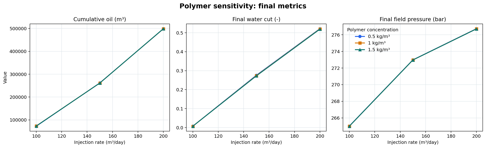
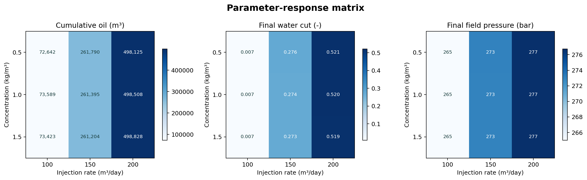
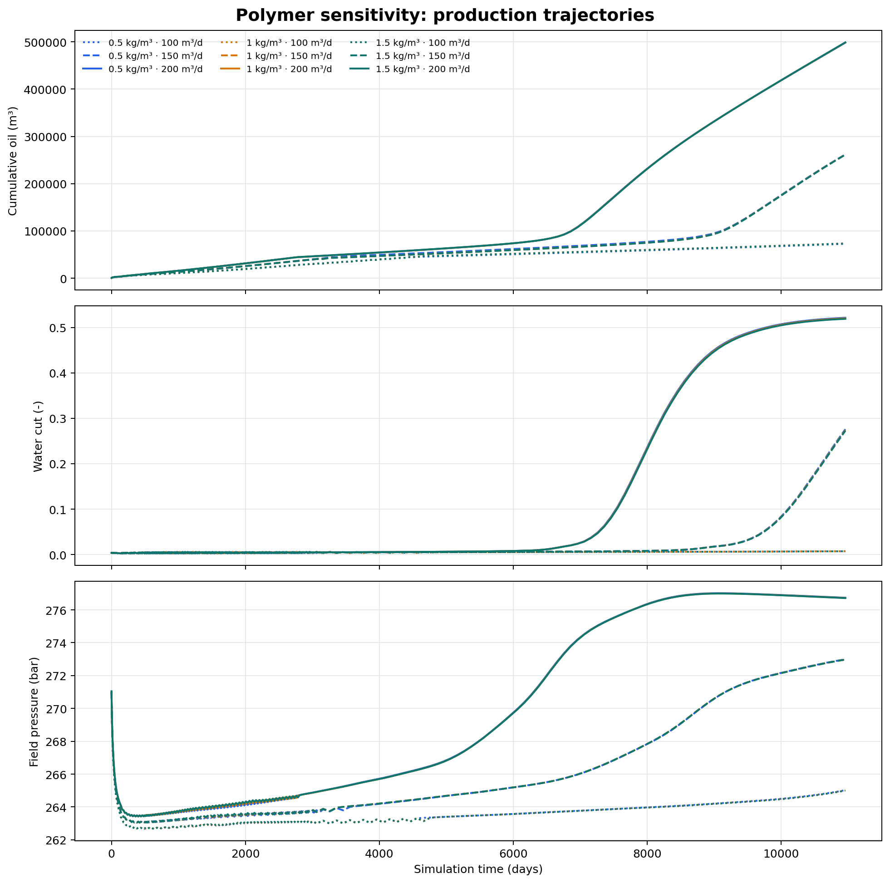

# polymer_sensitivity_v1 参数敏感性实验报告

## 技术摘要

- 9 个参数组合全部成功，算例级表 9 行、时间序列表 2,098 行；关键字段无空值、无重复主键、无非有限数值，数据可用于本轮描述性敏感性比较。
- 注入速率是主要驱动因素：从 100 增至 200 m³/day 时，跨浓度平均累计产油增加 425,269.1 m³（580.8%），末期压力增加 11.72 bar。
- 聚合物浓度在 0.5–1.5 kg/m³ 范围内对累计产油的平均净变化仅 299.4 m³（0.11%）；对末期含水率有小幅降低作用，平均变化 -0.0019。
- 最大累计产油为 498,828.0 m³，对应 1.5 kg/m³、200 m³/day；但这是描述性结果，不等同于经济最优方案。

## 注入速率主导累计产油、含水率和压力

三幅图以相同的参数组合比较末期指标。累计产油随注入速率单调上升，同时末期含水率与压力也上升，说明增注带来产油增益的同时伴随更强水窜/产水风险与压力响应。浓度曲线大体重合，表明当前浓度范围的边际影响远小于注入速率。

矩阵保留每个组合的精确相对位置。浓度效应在不同注入速率下并非完全一致，因此不应从 9 个确定性组合推断普适单调规律。

## 动态曲线确认终值比较不是单点伪象

累计产油、含水率和压力曲线覆盖 1–10,960 天。线型表示注入速率、颜色表示浓度；注入速率造成的轨迹分离持续存在，而同一速率下不同浓度曲线接近。

## 数据范围与指标定义

- 实验设计：3 个聚合物浓度（0.5、1.0、1.5 kg/m³）× 3 个注入速率（100、150、200 m³/day）的笛卡尔积。
- `final_cumulative_oil_m3`：各算例最后时间点的现场累计产油。
- `final_water_cut_fraction`：各算例最后时间点的现场含水率，0–1 小数。
- `final_field_pressure_bar`：由时间序列表每个算例最后时间点提取的现场压力。
- 比较基准：主效应使用另一个参数三个水平的算术平均；未拟合因果或响应面模型。

| 浓度 (kg/m³) | 注入速率 (m³/day) | 累计产油 (m³) | 末期含水率 | 末期压力 (bar) |
|---:|---:|---:|---:|---:|
| 0.5 | 100 | 72,642.1 | 0.0073 | 265.02 |
| 0.5 | 150 | 261,790.0 | 0.2759 | 272.99 |
| 0.5 | 200 | 498,125.3 | 0.5214 | 276.74 |
| 1 | 100 | 73,588.7 | 0.0073 | 265.00 |
| 1 | 150 | 261,394.6 | 0.2739 | 272.98 |
| 1 | 200 | 498,508.2 | 0.5201 | 276.72 |
| 1.5 | 100 | 73,423.4 | 0.0072 | 265.00 |
| 1.5 | 150 | 261,203.9 | 0.2726 | 272.97 |
| 1.5 | 200 | 498,828.0 | 0.5190 | 276.71 |

## 方法与质量检查

对算例主键、`case_id + time_days` 复合键、空值、有限值、时间覆盖、时间单调性及物理范围进行检查。所有算例状态为 `succeeded`，时间覆盖一致；每个算例 231–237 个求解输出点的差异由模拟器自适应时间步产生，不视为缺失。

## 局限性与稳健性

- 本报告是单一 Deck、固定 OPM Flow 2026.04 下的确定性数值模拟结果，不代表真实油田数据，也不建立因果关系。
- 每个参数组合只有一次模拟，无随机重复、历史拟合不确定性或数值网格敏感性评估，不能给出置信区间。
- 未纳入聚合物成本、注入能耗、处理能力、采收率分母与净现值，因此“最大累计产油”不是经济最优。
- 含水率随注入速率显著上升，任何工程推荐都应联合产水处理能力和压力约束。

## 建议的下一步

1. 增加基准水驱/零聚合物算例，量化聚合物增量贡献。
2. 在 150–200 m³/day 区间加密注入速率，并加入聚合物成本与净现值指标。
3. 对渗透率场、相渗和聚合物吸附参数开展不确定性分析，而不是只扩展控制参数网格。
4. 将数据质量检查固化为回归测试，避免后续实验出现字段漂移或不完整合并。

## 进一步问题

- 聚合物浓度对含水率的小幅改善是否足以覆盖药剂成本？
- 高注入速率下的压力是否满足具体井口、地层破裂与设施约束？
- 在不同非均质实现中，当前排序是否保持稳定？
